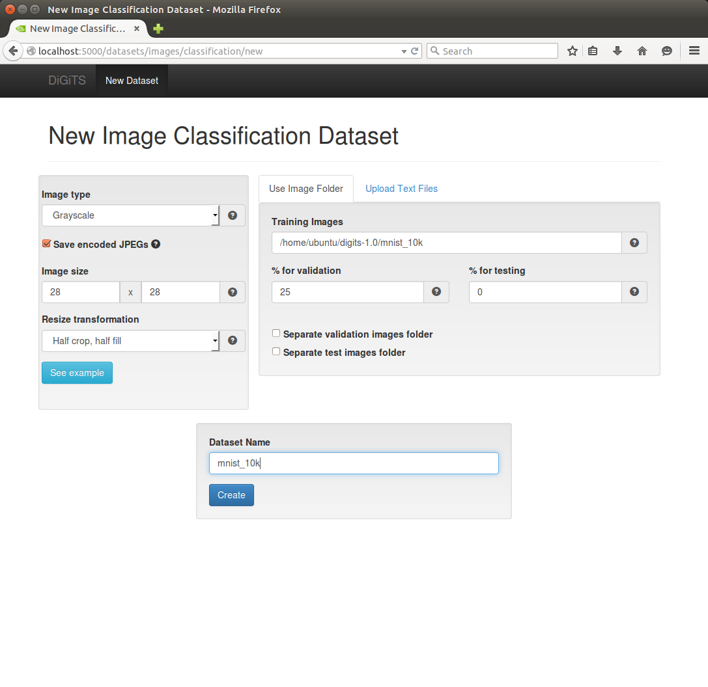
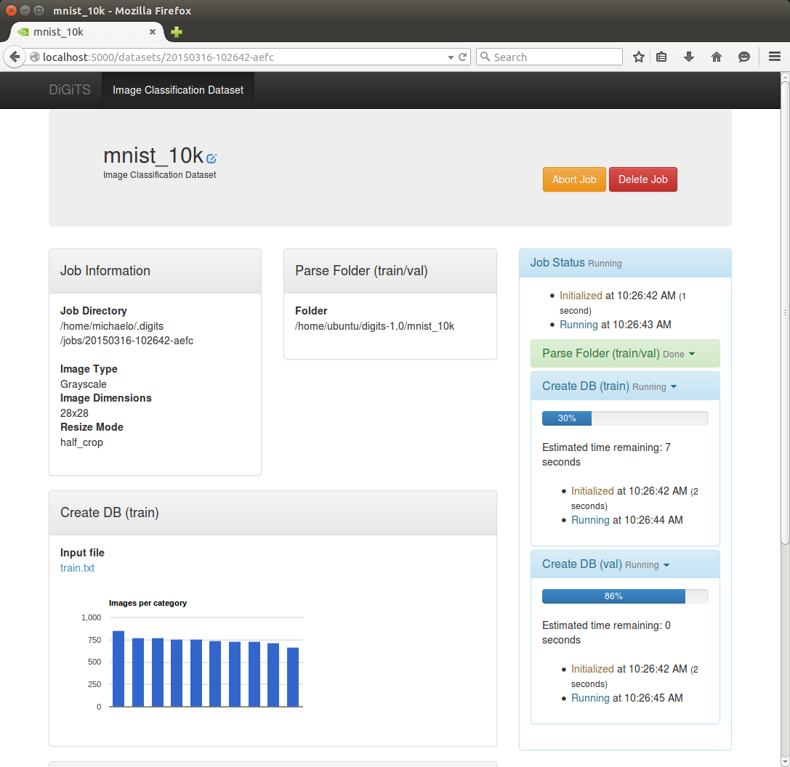
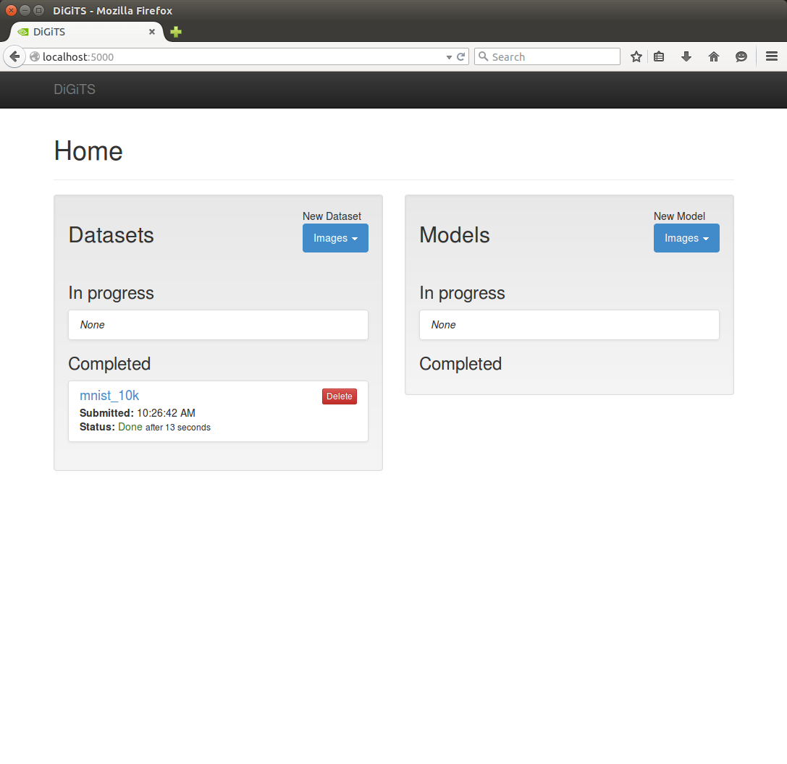
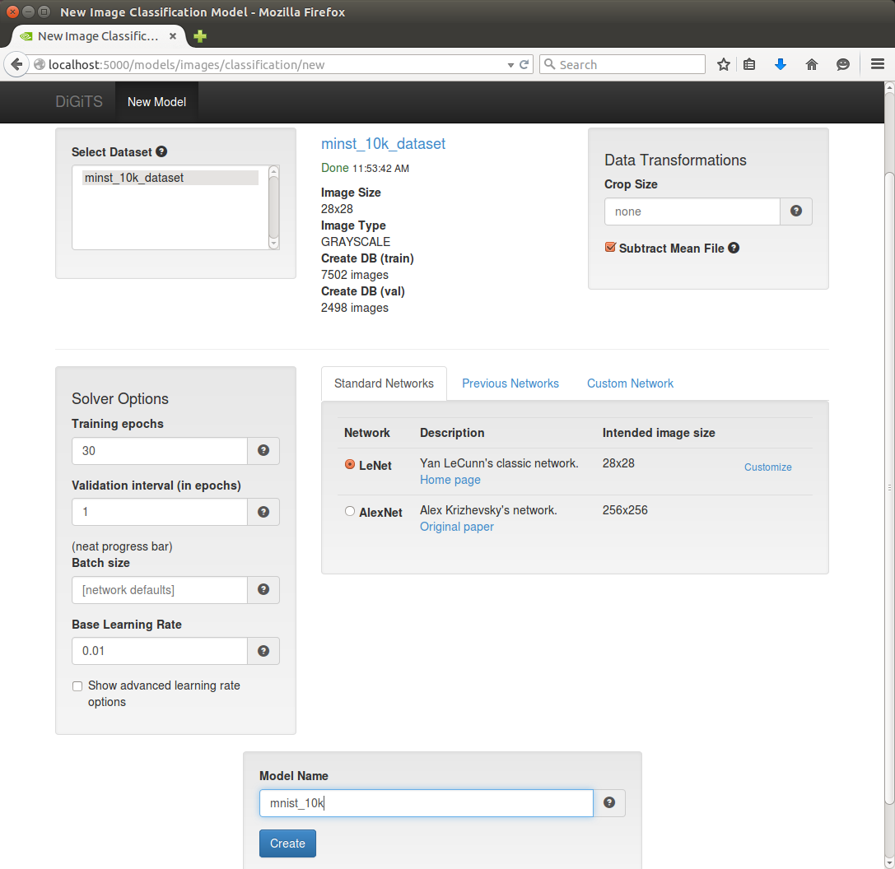
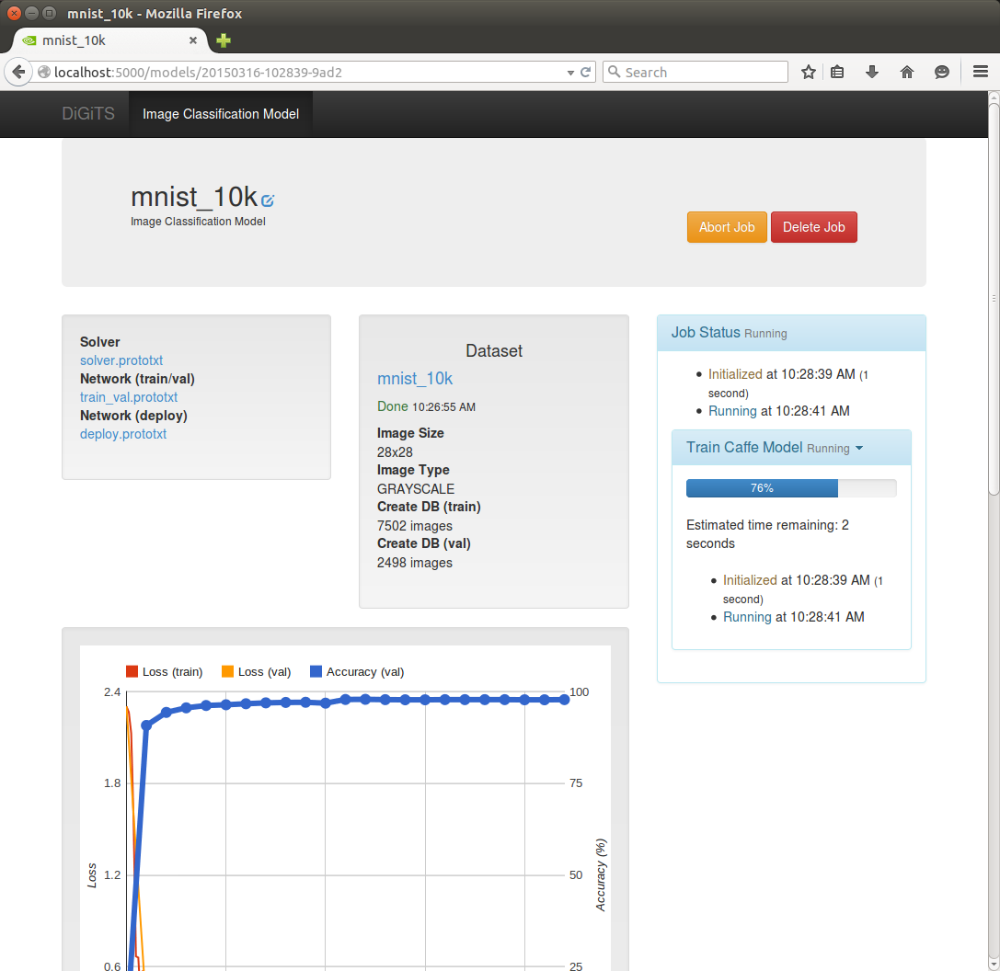
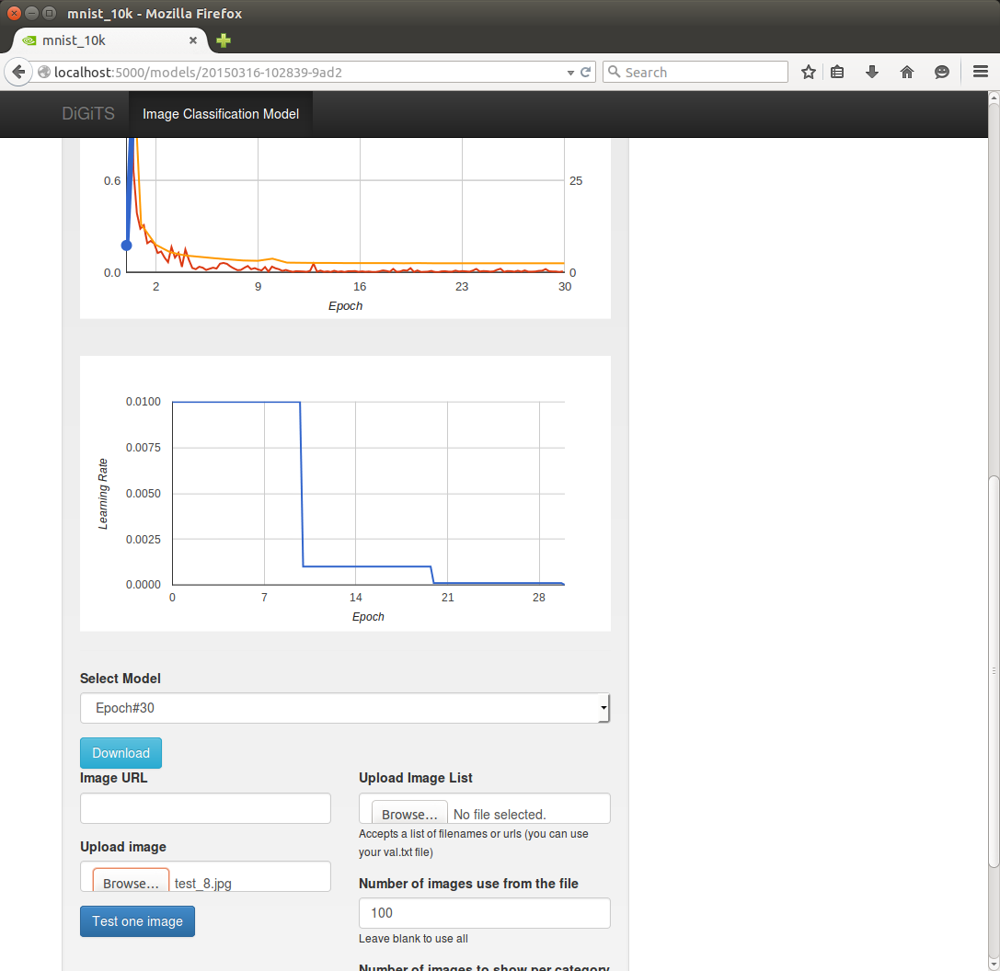
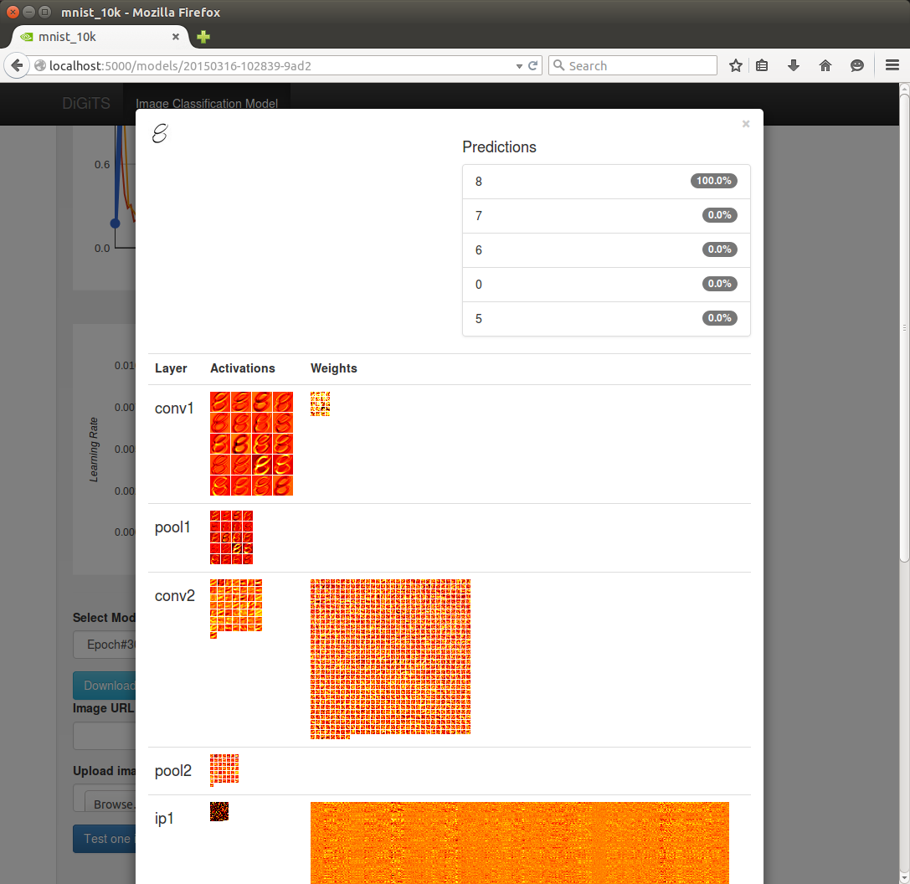

# Getting Started

For installation instructions:
* [Web Installer](WebInstall.md)

## Starting DIGITS

To start the server up on port 5000 (if you are using the web installer):

    % cd $HOME/digits-1.0
    % ./run_me.sh

If you are not using the web installer, you can start the server this way:

    % ./digits-devserver

NOTE:  The first time DiGiTS is run, you will be asked for the location of some directories.  It should look something like the following:
<pre>
./runme.sh
  ___  _  ___ _ _____ ___
 |   \(_)/ __(_)_   _/ __|
 | |) | | (_ | | | | \__ \
 |___/|_|\___|_| |_| |___/

Welcome to the DiGiTS config module.

Where is caffe installed? (enter "SYS" if installed system-wide)
    [default is /home/username/digits-1.0/caffe]
(q to quit) >>>

Attached devices:
Device #0:
    Name: GeForce GTX 980
    Compute capability: 5.2
    Memory: 4.0 GB
    Multiprocessors: 16

Device #1:
    Name: GeForce GTX 980
    Compute capability: 5.2
    Memory: 4.0 GB
    Multiprocessors: 16

Input the IDs of the devices you would like to use, separated by commas, in order of preference.
    [default is 0,1]
(q to quit) >>>

Where would you like to store jobs?
    [default is /home/username/.digits/jobs]
(q to quit) >>>

What is the minimum log level that you want to save to your logfile? [error/warning/info/debug]
    [default is info]
(q to quit) >>>

New config:
            gpu_list - 0,1
          secret_key - <secret key>
           log_level - info
            jobs_dir - /home/ubuntu/.digits/jobs
          caffe_root - /home/ubuntu/digits-1.0/caffe

 * Running on http://0.0.0.0:5000/
</pre>

Included with the DiGiTS web installer is the a subset of the [MNIST handwritten digit database](http://yann.lecun.com/exdb/mnist) as well as some validation images.  The data set is in `mist_10k` and the validation images are in `mnist_test`.

## Using DiGiTS

* Now that DIGITS is running on port 5000, open a browser and go to http://localhost:5000.  You should see the DiGiTS home screen:

* Create a dataset
  * In the Datasets section on the left side of the page, click on the blue "Images" button and select "Classification" which will take you to the "New Image Classification Dataset" page.  For this example, do the following:
  * Change the image type to Grayscale
  * Change the image size to 28 x 28
  * Type in the path to the MNIST training images.  For example: /home/ubuntu/digits-1.0/mnist_10k. If you are not using the web installer, follow the directions in the tooltip for structuring your data folders.
  * Give the dataset a name
  * Click on the "Create" button

* While creating a model, you should see the expected completion time on the right side:

* When the data set has completed training, go back to the home page, by clicking "DiGiTS" in the top left hand part of the page.  You should now see that there is a trained data set.

* In the Models section on the left side of the page, click on the blue "Images" button and select "Classification." which will take you to the "New Image Classification Model" page.  For this example, do the following:
  * Choose the mist dataset in the "Select Dataset module"
  * Choose the "LeNet" network in the "Standard networks" tab
  * Give the model a name
  * Click on the "Create" button

* While creating a model, you should see the expected completion time on the right side:

* To test the model, scroll to the bottom of the page.  On the left side are tools for testing the model.
  * Click on the "Browse" button which will bring up a local file browser.  Included with the distribution are some test images in a test_digits folder, /home/ubuntu/digits-1.0/test_digits
  * In the file browser dialog, choose one of the images and then click on "Open"
  * In the Model page, click on "Test one image."

* DIGITS will display the top five classifications as well as the visualization of some of the layers.

