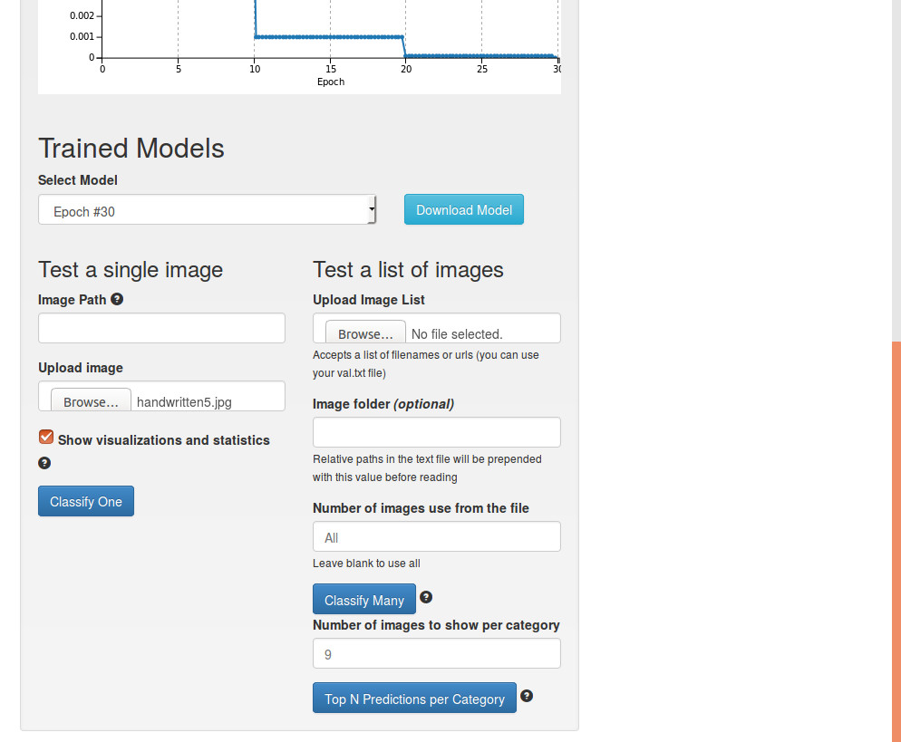
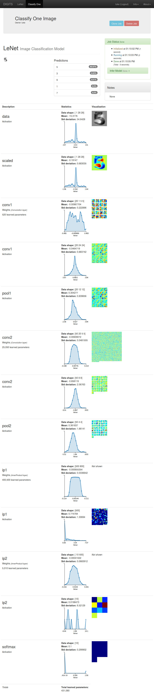

# Getting Started

Table of Contents
=================
* [Installation](#installation)
* [Starting DIGITS](#starting-digits)
* [Using DIGITS](#using-digits)
    * [Creating a Dataset](#creating-a-dataset)
    * [Training a Model](#training-a-model)

## Installation

If you are using the web installer, check out this [installation page](WebInstall.md).

If you are installing from source, check out the [README](../README.md#installation).

## Starting DIGITS

If you are using the web installer use the `runme.sh` script:

    % cd $HOME/digits-1.1
    % ./runme.sh

If you are not using the web installer, use the `digits-devserver` script:

    % cd $HOME/digits
    % ./digits-devserver

The first time DIGITS is run, you will be asked to confirm some configuration options. In most cases, you should be able to accept the defaults by pressing `ENTER` repeatedly.

<pre>
% ./digits-devserver
  ___ ___ ___ ___ _____ ___
 |   \_ _/ __|_ _|_   _/ __|
 | |) | | (_ || |  | | \__ \
 |___/___\___|___| |_| |___/

Welcome to the DIGITS config module.

Where is caffe installed?
    (enter "SYS" if installed system-wide)
    [default is /home/username/caffe]
(q to quit) >>>
Accepting default value of "/home/username/caffe"

Attached devices:
Device #0:
    Name                 GeForce GTX 980
    Compute capability   5.2
    Memory               4.0 GB
    Multiprocessors      16

Device #1:
    Name                 Tesla K20c
    Compute capability   3.5
    Memory               4.69 GB
    Multiprocessors      13

Input the IDs of the devices you would like to use, separated by commas, in order of preference.
    (enter "NONE" if you want to run in CPU-only mode)
    [default is 0,1]
(q to quit) >>>
Accepting default value of "0,1"

Where would you like to store jobs?
    [default is /home/username/.digits/jobs]
(q to quit) >>>
Accepting default value of "/home/username/.digits/jobs"

What is the minimum log level that you want to save to your logfile? [error/warning/info/debug]
    [default is info]
(q to quit) >>>
Accepting default value of "info"

New config:
            gpu_list - 0,1
          secret_key - acea8d2a9d9a3abaf930f235
           log_level - info
            jobs_dir - /home/username/.digits/jobs
          caffe_root - /home/username/caffe

 * Running on http://0.0.0.0:5000/
</pre>

## Using DIGITS

Now that DIGITS is running, open a browser and go to http://localhost:5000.  You should see the DIGITS home screen:

For the example in this document, we will be using the [MNIST handwritten digit database](http://yann.lecun.com/exdb/mnist) as our dataset and [LeNet-5](http://yann.lecun.com/exdb/lenet/) for our network. Both are made generously made available by Yann LeCun on his [website](http://yann.lecun.com/).

If you are not using the web installer, please refer to [this page](ImageFolderFormat.md) for preparing your own dataset. Some of the configuration options listed below may be different for your dataset.

### Creating a Dataset

In the Datasets section on the left side of the page, click on the blue `Images` button and select `Classification` which will take you to the "New Image Classification Dataset" page.

* Change the image type to `Grayscale`
* Change the image size to 28 x 28
* Type in the path to the MNIST training images
  * `/home/username/digits-1.1/mnist/train` if you are using the web installer
* Give the dataset a name
* Click on the `Create` button

While the model creation job is running, you should see the expected completion time on the right side:

When the data set has completed training, go back to the home page, by clicking `DIGITS` in the top left hand part of the page.  You should now see that there is a trained data set.

### Training a Model

In the Models section on the left side of the page, click on the blue `Images` button and select `Classification` which will take you to the "New Image Classification Model" page.  For this example, do the following:
* Choose the MNIST dataset in the "Select Dataset" field
* Choose the `LeNet` network in the "Standard Networks" tab
* Give the model a name
* Click on the `Create` button

While training the model, you should see the expected completion time on the right side:

To test the model, scroll to the bottom of the page.  On the left side are tools for testing the model.
* Click on the `Upload Image` field which will bring up a local file browser and choose a file
  * If you've used the web installer, choose one in `/home/username/digits-1.1/mnist/test`
* Or, find an image on the web and paste the URL into the `Image URL` field
* Click on `Classify One Image`

DIGITS will display the top five classifications and corresponding confidence values.

