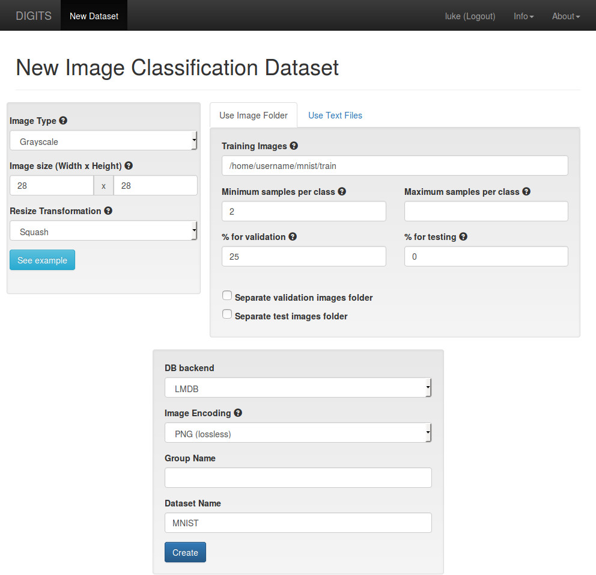

# Getting Started

Table of Contents
=================
* [Installation](#installation)
* [Starting the server](#starting-the-server)
* [Using the webapp](#using-the-webapp)
    * [Creating a Dataset](#creating-a-dataset)
    * [Training a Model](#training-a-model)
* [Using the REST API](#using-the-rest-api)

## Installation

If you are using the web installer, check out this [installation page](WebInstall.md).

If you are installing from source, check out the [README](../README.md#installation).

## Starting the server

If you are using the web installer use the `runme.sh` script:

    % cd $HOME/digits-2.0
    % ./runme.sh

If you are not using the web installer, use the `digits-devserver` script:

    % cd $HOME/digits
    % ./digits-devserver

The first time DIGITS is run, you may be asked to provide some configuration options.

```
% ./digits-devserver
==================================== Caffe =====================================
Where is caffe installed?

    Suggested values:
    (P*) [PATH/PYTHONPATH] <PATHS>
>> ~/caffe
Using "/home/username/caffe"

Saved config to /home/username/digits/digits/digits.cfg
  ___ ___ ___ ___ _____ ___
 |   \_ _/ __|_ _|_   _/ __|
 | |) | | (_ || |  | | \__ \
 |___/___\___|___| |_| |___/ 2.2.0

 * Running on http://0.0.0.0:5000/
```

 Most values are set silently by default. If you need more control over your configuration, try one of these commands:

    # Set more options before starting the server
    ./digits-devserver --config
    # Advanced usage
    python -m digits.config.edit --verbose

## Using the Webapp

Now that DIGITS is running, open a browser and go to http://localhost:5000.  You should see the DIGITS home screen:


For the example in this document, we will be using the [MNIST handwritten digit database](http://yann.lecun.com/exdb/mnist) as our dataset and [LeNet-5](http://yann.lecun.com/exdb/lenet/) for our network. Both are generously made available by Yann LeCun on [his website](http://yann.lecun.com/).

If you are not using the web installer, you can use the script at `tools/download_data/main.py` to download the MNIST dataset. See [Standard Datasets](StandardDatasets.md) for details.

### Creating a Dataset

In the Datasets section on the left side of the page, click on the blue `Images` button and select `Classification` which will take you to the "New Image Classification Dataset" page.

* Type in the path to the MNIST training images
  * `/home/username/digits-2.0/mnist/train` if you are using the web installer
* Change the `Image Type` to `Grayscale`
* Change the `Image size` to 28 x 28
* Give the dataset a name
* Click on the `Create` button



While the job is running, you should see the expected completion time on the right side:


When the job is finished, go back to the home page by clicking `DIGITS` in the top left hand part of the page.
You should now see your dataset listed.


### Training a Model

In the Models section on the right side of the page, click on the blue `Images` button and select `Classification` which will take you to the "New Image Classification Model" page.  For this example, do the following:
* Choose the "MNIST" dataset in the `Select Dataset` field
* Choose the `LeNet` network in the `Standard Networks` tab
* Give the model a name
* Click on the `Create` button


While training the model, you should see the expected completion time on the right side:


To test the model, scroll to the bottom of the page.
* Click on the `Upload image` button and choose a file
  * If you've used the web installer, choose one in `/home/username/digits-2.0/mnist/test`
* Or, find an image on the web and paste the URL into the `Image URL` field
* Check the `Show visualizations and statistics` box
* Click on `Classify One`


At the top of the page, DIGITS displays the top five classifications and corresponding confidence values.
DIGITS also provides visualizations and statistics about the weights and activations of each layer in your network.


## Using the REST API

Use your favorite tool (`curl`, `wget`, etc.) to interact with DIGITS through the [REST API](API.md).

    curl localhost:5000/index.json

