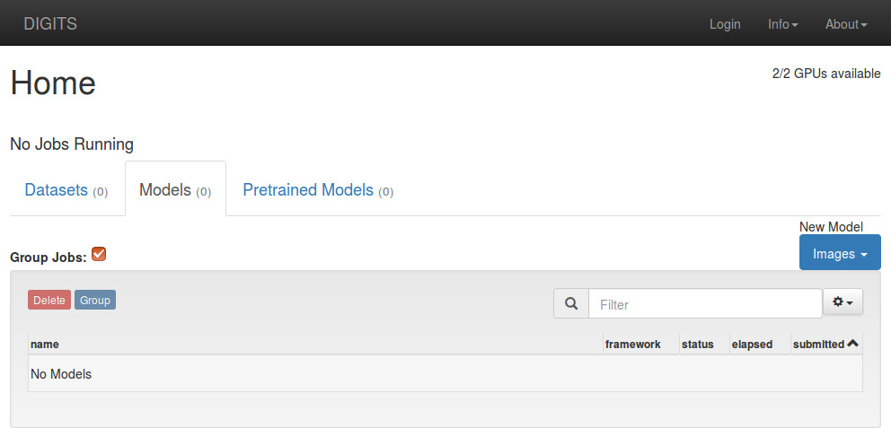
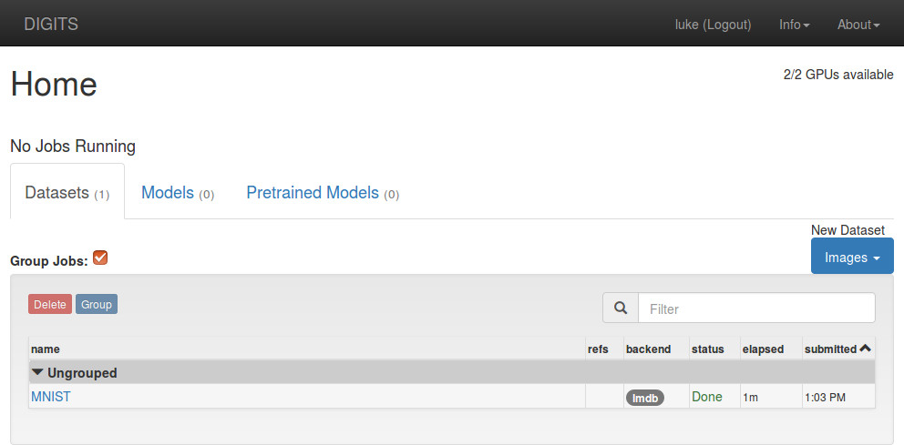
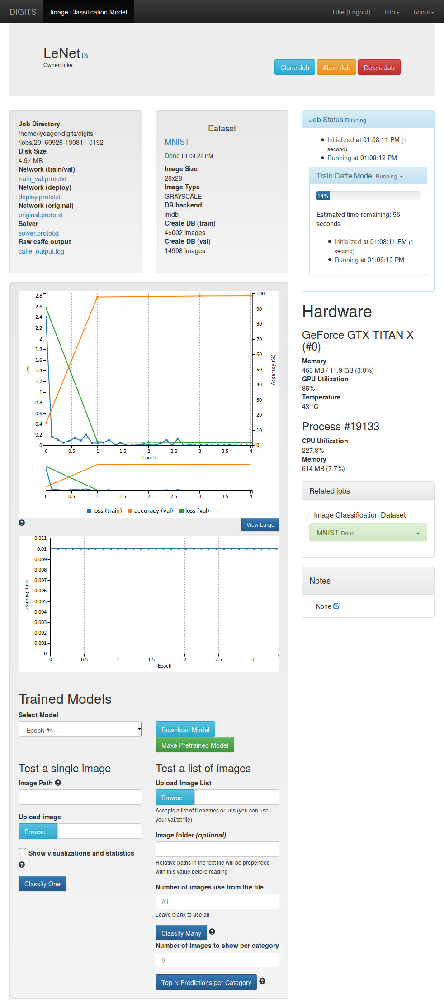

# Getting Started

Table of Contents
=================
* [Installation](#installation)
* [Using the webapp](#using-the-webapp)
    * [Creating a Dataset](#creating-a-dataset)
    * [Training a Model](#training-a-model)
* [Getting Started With Torch7 in DIGITS](#getting-started-with-torch7-in-digits)

## Installation

Follow [these instructions](UbuntuInstall.md) to install via deb packages.

Follow [these instructions](BuildDigits.md) to build from source.

## Using the Webapp

Once you have installed and started DIGITS, open up a web browser and navigate to the home screen.
The server should be at either `http://localhost/` (if installed from deb packages), `http://localhost:5000/` (if using `digits-devserver`) or `http://localhost:34448/` (if using `digits-server`).



For the example in this document, we will be using the [MNIST handwritten digit database](http://yann.lecun.com/exdb/mnist) as our dataset and [LeNet-5](http://yann.lecun.com/exdb/lenet/) for our network.
Both are generously made available by Yann LeCun on [his website](http://yann.lecun.com/).

Use the following command to download the MNIST dataset (for deb package installations, the script is at `/usr/share/digits/tools/download_data/main.py`):
```
$ tools/download_data/main.py mnist ~/mnist
Downloading url=http://yann.lecun.com/exdb/mnist/train-images-idx3-ubyte.gz ...
Downloading url=http://yann.lecun.com/exdb/mnist/train-labels-idx1-ubyte.gz ...
Downloading url=http://yann.lecun.com/exdb/mnist/t10k-images-idx3-ubyte.gz ...
Downloading url=http://yann.lecun.com/exdb/mnist/t10k-labels-idx1-ubyte.gz ...
Uncompressing file=train-images-idx3-ubyte.gz ...
Uncompressing file=train-labels-idx1-ubyte.gz ...
Uncompressing file=t10k-images-idx3-ubyte.gz ...
Uncompressing file=t10k-labels-idx1-ubyte.gz ...
Reading labels from /home/username/mnist/train-labels.bin ...
Reading images from /home/username/mnist/train-images.bin ...
Reading labels from /home/username/mnist/test-labels.bin ...
Reading images from /home/username/mnist/test-images.bin ...
Dataset directory is created successfully at '/home/username/mnist'
Done after 16.722807169 seconds.
```
See [Standard Datasets](StandardDatasets.md) for more details.

### Creating a Dataset

In the Datasets section on the left side of the page, click on the blue `Images` button and select `Classification` which will take you to the "New Image Classification Dataset" page.

* Type in the path to the MNIST training images
  * You can also add the the folder of MNIST test images as a "Separate validation images folder", if you like. Don't use the "test images" fields - test images are not used for anything in DIGITS yet.
* Change the `Image Type` to `Grayscale`
* Change the `Image size` to 28 x 28
* Give the dataset a name
* Click on the `Create` button


While the job is running, you should see the expected completion time on the right side:


When the job is finished, go back to the home page by clicking `DIGITS` in the top left hand part of the page.
You should now see your dataset listed.



### Training a Model

In the Models section on the right side of the page, click on the blue `Images` button and select `Classification` which will take you to the "New Image Classification Model" page.  For this example, do the following:
* Choose the "MNIST" dataset in the `Select Dataset` field
* Choose the `LeNet` network in the `Standard Networks` tab
* Give the model a name
* Click on the `Create` button


While training the model, you should see the expected completion time on the right side:



To test the model, scroll to the bottom of the page.
* Click on the `Upload image` button and choose a file
  * There are plenty to choose from in `/home/username/mnist/test/`
* Or, find an image on the web and paste the URL into the `Image URL` field
* Check the `Show visualizations and statistics` box
* Click on `Classify One`


At the top of the page, DIGITS displays the top five classifications and corresponding confidence values.
DIGITS also provides visualizations and statistics about the weights and activations of each layer in your network.


## Getting Started With Torch7 in DIGITS

Follow [these instructions](GettingStartedTorch.md) for information on getting started with Torch7 in DIGITS.

