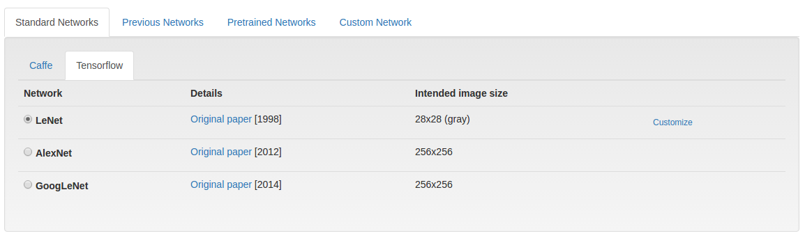
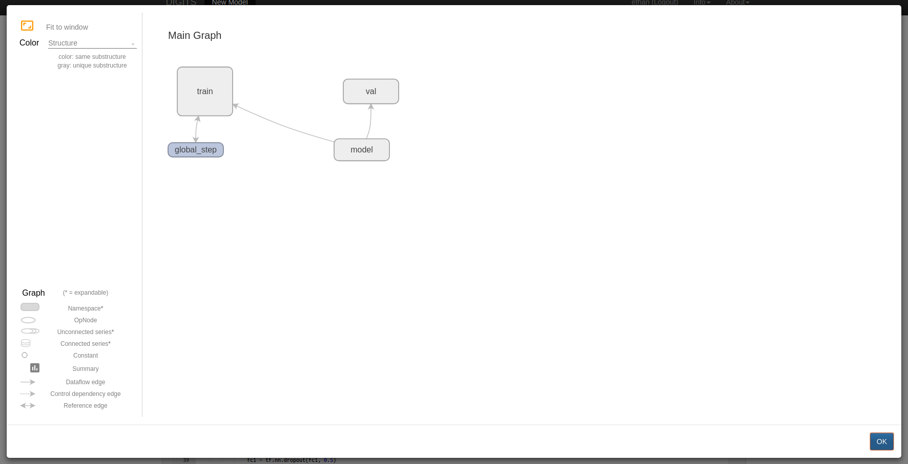
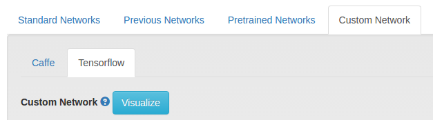
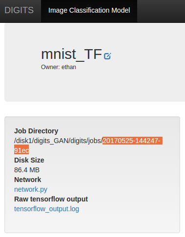
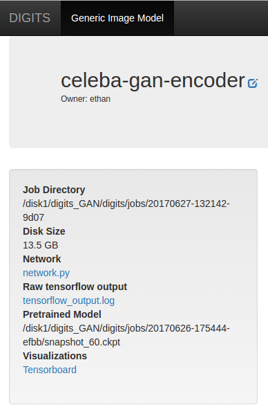

# Getting Started with TensorFlow™ in DIGITS

Table of Contents
=================
* [Enabling Support For TensorFlow In DIGITS](#enabling-support-for-tensorflow-in-digits)
* [Selecting TensorFlow When Creating A Model In DIGITS](#selecting-tensorflow-when-creating-a-model-in-digits)
* [Defining A TensorFlow Model In DIGITS](#defining-a-tensorflow-model-in-digits)
    * [Provided Properties](#provided-properties)
    * [Internal Properties](#internal-properties)
    * [Tensors](#tensors)
* [Other TensorFlow Tools in DIGITS](#other-tensorflow-tools-in-digits)
    * [Provided Helpful Functions](#provided-helpful-functions)
    * [Visualization With TensorBoard](#visualization-with-tensorboard)
* [Examples](#examples)
    * [Simple Auto-Encoder Network](#simple-auto-encoder-network)
    * [Freezing Variables in Pre-Trained Models by Renaming](#freezing-variables-in-pre-trained-models-by-renaming)
    * [Multi-GPU Training](#multi-gpu-training)

## Enabling Support For TensorFlow In DIGITS

DIGITS will automatically enable support for TensorFlow if it detects that TensorFlow-gpu is installed in the system. This is done by a line of python code that attempts to ```import tensorflow``` to see if it actually imports.

If DIGITS cannot enable tensorflow, a message will be printed in the console saying: ```TensorFlow support is disabled```

## Selecting TensorFlow When Creating A Model In DIGITS

Click on the "TensorFlow" tab on the model creation page



## Defining A TensorFlow Model In DIGITS

To define a TensorFlow model in DIGITS, you need to write a python class that follows this basic template

```python
class UserModel(Tower):

    @model_propertyOther TensorFlow Tools in DIGITS
    def inference(self):
        # Your code here
        return model

    @model_property#with tf.variable_scope(digits.GraphKeys.MODEL, reuse=None):
    def loss(self):
        # Your code here
        return loss
```

For example, this is what it looks like for [LeNet-5](http://yann.lecun.com/exdb/lenet/), a model that was created for the classification of hand written digits by Yann Lecun:

```python
class UserModel(Tower):

    @model_property
    def inference(self):
        x = tf.reshape(self.x, shape=[-1, self.input_shape[0], self.input_shape[1], self.input_shape[2]])
        # scale (divide by MNIST std)
        x = x * 0.0125
        with slim.arg_scope([slim.conv2d, slim.fully_connected],
                            weights_initializer=tf.contrib.layers.xavier_initializer(),
                            weights_regularizer=slim.l2_regularizer(0.0005) ):
            model = slim.conv2d(x, 20, [5, 5], padding='VALID', scope='conv1')
            model = slim.max_pool2d(model, [2, 2], padding='VALID', scope='pool1')
            model = slim.conv2d(model, 50, [5, 5], padding='VALID', scope='conv2')
            model = slim.max_pool2d(model, [2, 2], padding='VALID', scope='pool2')
            model = slim.flatten(model)
            model = slim.fully_connected(model, 500, scope='fc1')
            model = slim.dropout(model, 0.5, is_training=self.is_training, scope='do1')
            model = slim.fully_connected(model, self.nclasses, activation_fn=None, scope='fc2')
            return model

    @model_property
    def loss(self):
        loss = digits.classification_loss(self.inference, self.y)
        accuracy = digits.classification_accuracy(self.inference, self.y)
        self.summaries.append(tf.summary.scalar(accuracy.op.name, accuracy))
        return loss
```

The properties ```inference``` and ```loss``` must be defined and the class must be called ```UserModel``` and it must inherit ```Tower```. This is how DIGITS will interact with the python code.

### Provided Properties

Properties that are accessible through ```self```

Property name | Type      | Description
--------------|-----------|------------
`nclasses`      | number    | Number of classes (for classification datasets). For other type of datasets, this is undefined
`input_shape`   | Tensor    | Shape (1D Tensor) of the first input Tensor. For image data, this is set to height, width, and channels accessible by [0], [1], and [2] respectively.
`is_training`   | boolean   | Whether this is a training graph
`is_inference`  | boolean   | Whether this graph is created for inference/testing
`x`             | Tensor    | The input node, with the shape of [N, H, W, C]
`y`             | Tensor    | The label, [N] for scalar labels, [N, H, W, C] otherwise. Defined only if self.is_training is True

### Internal Properties

These properties are in the `UserModel` class written by the user

Property name | Return Type | Description
--------------|-------------|------------
`__init()__`    | None        | The constructor for the `UserModel` class
`inference()`   | Tensor      | Called during training and inference
`loss()`        | Tensor      | Called during training to determine the loss and variables to train

### Tensors

The network are fed with TensorFlow Tensor objects that are in [N, H, W, C] format.

## Other TensorFlow Tools in DIGITS

DIGITS provides a few useful tools to help with your development with TensorFlow.

### Provided Helpful Functions

DIGITS provides a few helpful functions to help you with creating the model. Here are the functions we provide inside the `digits` class

Function Name       | Parameters          | Description
--------------------|---------------------|-------------
`classification_loss` | pred - the images to be classified <br> y - the labels | Used for classification training to calculate the loss of image classification
`mse_loss`            | lhs - left hand tensor <br> rhs - right hand tensor | Used for calculating the mean square loss between 2 tensors
`constrastive_loss`   | lhs - left hand tensor <br> rhs - right hand tensor <br> y - `labels` | Calculates the contrastive loss with respect to the Caffe definition
`classification_accuracy` | pred - the image to be classified <br> y - the labels | Used to measure how accurate the classification task is
`nhwc_to_nchw` | x - the tensor to transpose | Transpose the tensor that was originally NHWC format to NCHW. The tensor must be a degree of 4
`nchw_to_nhwc` | x - the tensor to transpose | Transpose the tensor that was originally NCHW format to NHWC. The tensor must be a degree of 4
`hwc_to_chw` | x - the tensor to transpose | Transpose the tensor that was originally HWC format to CHW. The tensor must be a degree of 3
`chw_to_hwc` | x - the tensor to transpose | Transpose the tensor that was originally CHW format to HWC. The tensor must be a degree of 3
`bgr_to_rgb` | x - the tensor to transform | Transform the tensor that was originally in BGR channels to RGB.
`rgb_to_bgr` | x - the tensor to transform | Transform the tensor that was originally in RGB channels to BGR.

### Visualization With TensorBoard



TensorBoard is a visualization tools provided by TensorFlow to see the graph of your neural network. DIGITS provides easy access to TensorBoard network visualization for your network while creating it. This can be accessed by clicking on the `Visualize` button under `Custom Network` as seen in the image below.



If there is something wrong with the network model, DIGITS will automatically provide with you the stacktrace and the error message to help you understand where the problem is.

You can also spin up the full Tensorboard server while your model is training with the command
```
$ tensorboard --logdir <job_dir>/tb/
```
where `<job_dir>` is the directory where them model is being trained at, which can be found here:



Afterwards, you can open up the Tensorboard page by going to
`http://localhost:6006`

Or you can click the `Tensorboard` link under Visualization



To know more about how TensorBoard works, its official documentation is availabile in the [official tensorflow documentaton](https://www.tensorflow.org/get_started/summaries_and_tensorboard)

## Examples

### Simple Auto-Encoder Network

The following network is a simple auto encoder to demostate the structure of how to use tensorflow in DIGITS. An auto encoder is a 2 part network that basically acts as a compression mechanism. The first part will try to compress an image to a size smaller than original while the second part will try to decompress the compressed representation created by the compression network.

```python
class UserModel(Tower):

    @model_property
    def inference(self):

        # the order for input shape is [0] -> H, [1] -> W, [2] -> C
        # this is because tensorflow's default order is NHWC
        model = tf.reshape(self.x, shape=[-1, self.input_shape[0], self.input_shape[1], self.input_shape[2]])
        image_dim = self.input_shape[0] * self.input_shape[1]

        with slim.arg_scope([slim.fully_connected], 
                        weights_initializer=tf.contrib.layers.xavier_initializer(),
                        weights_regularizer=slim.l2_regularizer(0.0005)):

            # first we reshape the images to something
            model = tf.reshape(_x, shape=[-1, image_dim])

            # encode the image
            model = slim.fully_connected(model, 300, scope='fc1')
            model = slim.fully_connected(model, 50, scope='fc2')

            # decode the image
            model = slim.fully_connected(model, 300, scope='fc3')
            model = slim.fully_connected(model, image_dim, activation_fn=None, scope='fc4')

            # form it back to the original
            model = tf.reshape(model, shape=[-1, self.input_shape[0], self.input_shape[1], self.input_shape[2]])
            
            return model

    @model_property
    def loss(self):

        # In an autoencoder, we compare the encoded and then decoded image with the original
        original = tf.reshape(self.x, shape=[-1, self.input_shape[0], self.input_shape[1], self.input_shape[2]])

        # self.inference is called to get the processed image
        model = self.inference
        loss = digits.mse_loss(original, model)

        return loss
```

### Freezing Variables in Pre-Trained Models by Renaming

The following is a demonstration of how to specifying which weights we would like to use for training. This works best if we are using a pre-trained model. This is applicable for fine tuning a model.

When you originally train a model, tensorflow will save the variables with their specified names. When you reload the model to retrain it, tensorflow will simutainously reload all those variables and mark them available to retrain if they are specified in the model definition. When you change the name of the variables in the model, tensorflow will then know to not train that variable and thus "freezes" it.

```python
class UserModel(Tower):

    @model_property
    def inference(self):

        model = construct_model()
        """code to construct the network omitted"""

        # assuming the original model have weight2 and bias2 variables
        # in here, we renamed them by adding the suffix _not_in_use
        # this tells TensorFlow that these variables in the pre-trained model should
        # not be retrained and it should be frozen
        # If we would like to freeze a weight, all we have to do is just rename it
        self.weights = {
            'weight1': tf.get_variable('weight1', [5, 5, self.input_shape[2], 20], initializer=tf.contrib.layers.xavier_initializer()),
            'weight2': tf.get_variable('weight2_not_in_use', [5, 5, 20, 50], initializer=tf.contrib.layers.xavier_initializer())
        }

        self.biases = {
            'bias1': tf.get_variable('bias1', [20], initializer=tf.constant_initializer(0.0)),
            'bias2': tf.get_variable('bias2_not_in_use', [50], initializer=tf.constant_initializer(0.0))
        }

        return model

    @model_property
    def loss(self):
        loss = calculate_loss()
        """code to calculate loss omitted"""
        return loss
```
