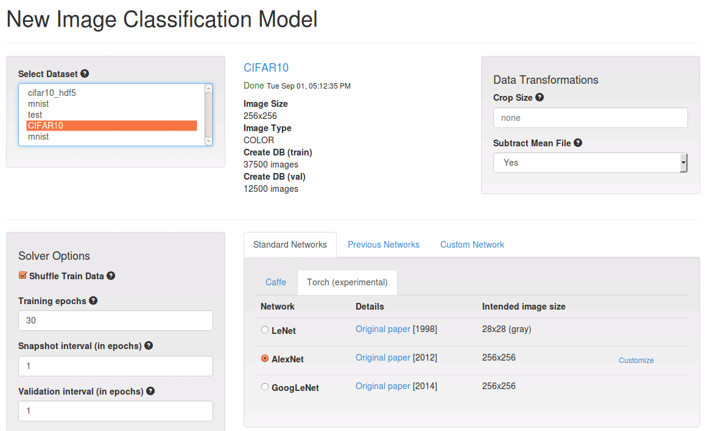

# Getting Started With Torch7 in DIGITS

Table of Contents
=================
* [Enabling support for Torch7 in DIGITS](#enabling-support-for-torch7-in-digits)
* [Selecting Torch7 when creating a model in DIGITS](#selecting-torch7-when-creating-a-model-in-digits)
* [Defining a Torch7 model in DIGITS](#defining-a-torch7-model-in-digits)
    * [External Parameters](#external-parameters)
    * [Internal Parameters](#internal-parameters)
    * [Tensors](#tensors)
* [Examples](#examples)
    * [Adjusting model to inputs dimensions and number of classes](#adjusting-model-to-input-dimensions-and-number-of-classes)
    * [Selecting the NN Backend](#selecting-the-nn-backend)
    * [Supervised Regression Learning](#supervised-regression-learning)
    * [Command Line Inference](#command-line-inference)
    * [Multi-GPU training](#multi-gpu-training)
* [Tutorials](#tutorials)
    * [Training an autoencoder](#training-an-autoencoder)
    * [Training a regression model](#training-a-regression-model)

## Enabling support for Torch7 in DIGITS

DIGITS will automatically enable support for Torch7 if either of these is true:

* The `TORCH_ROOT` environment variable is set

        export TORCH_ROOT=~/torch

* The `th` executable is found in your path

        export PATH=$PATH:~/torch/install/bin

## Selecting Torch7 when creating a model in DIGITS

Click on the "Torch" tab on the model creation page:



> NOTE: by default, Torch7 initializes the weights of linear and convolutional layers according to the method introduced in `LeCun, Yann A., et al. "Efficient backprop." Neural networks: Tricks of the trade. Springer Berlin Heidelberg, 2012. 9-48.`.
Although this weight initialization scheme performs reasonably well under many diverse circumstances, this is rarely optimal and you might notice that Caffe is sometimes able to learn more quickly when using e.g. Xavier initialization.
See [these examples](../examples/weight-init/README.md) for more information.

## Defining a Torch7 model in DIGITS

To define a Torch7 model in DIGITS you need to write a Lua function that takes a table of external network parameters as argument and returns a table of internal network parameters.
For example, the following code defines a flavour of LeNet:

```lua
return function(params)
    -- adjust to number of channels in input images - default to 1 channel
    -- during model visualization
    local channels = (params.inputShape and params.inputShape[1]) or 1
    local lenet = nn.Sequential()
    lenet:add(nn.MulConstant(0.00390625))
    lenet:add(nn.SpatialConvolution(channels,20,5,5,1,1,0)) -- channels*28*28 -> 20*24*24
    lenet:add(nn.SpatialMaxPooling(2, 2, 2, 2)) -- 20*24*24 -> 20*12*12
    lenet:add(nn.SpatialConvolution(20,50,5,5,1,1,0)) -- 20*12*12 -> 50*8*8
    lenet:add(nn.SpatialMaxPooling(2,2,2,2)) --  50*8*8 -> 50*4*4
    lenet:add(nn.View(-1):setNumInputDims(3))  -- 50*4*4 -> 800
    lenet:add(nn.Linear(800,500))  -- 800 -> 500
    lenet:add(nn.ReLU())
    lenet:add(nn.Linear(500, 10))  -- 500 -> 10
    lenet:add(nn.LogSoftMax())
    return {
        model = lenet,
        loss = nn.ClassNLLCriterion(),
        trainBatchSize = 64,
        validationBatchSize = 100,
    }
end
```

### External parameters

External parameters are provided by DIGITS:

Parameter name  | Type     | Description
--------------- | -------- | --------
ngpus           | number   | Tells how many GPUs are available (0 means CPU)
nclasses        | number   | Number of classes (for classification datasets). For other datasets this is undefined.
inputShape      | Tensor   | Shape (1D Tensor) of first input Tensor. For image data this is set to {channels, height, width}. Note: this parameter is undefined during model visualization.

### Internal parameters

Those parameters are returned by the user-defined function:

Parameter name        | Type         | Mandatory | Description
-----------------     | ------------ | --------- | -------------
model                 | nn.module    | Yes       | A nn.module container that defines the model to use.
loss                  | nn.criterion | No        | A nn.criterion to use during training. Defaults to nn.ClassNLLCriterion.
croplen               | number       | No        | If specified, inputs images will be cropped randomly to a square of the specified size.
labelHook             | function     | No        | A function(input,dblabel) that returns the intended label(target) for the current batch given the provided input and label in database. By default the database label is used.
trainBatchSize        | number       | No        | If specified, sets train batch size. May be overridden by user in DIGITS UI.
validationBatchSize   | number       | No        | If specified, sets validation batch size. May be overridden by user in DIGITS UI.
fineTuneHook          | function     | No        | A function(net) that returns the model to be used for fine-tuning. The untuned model is passed as a function parameter.
disableAutoDataParallelism | boolean | No        | By default models are encapsulated in a nn.DataParallelTable container to enable multi-GPU training when more than 1 GPUs are selected. Setting this flag to `true` disables this mechanism.

### Tensors

Networks are fed with Torch Tensor objects in the NxCxHxW format (index in batch x channels x height x width).
If a GPU is available, Tensors are provided as Cuda tensors and the model and criterion are moved to GPUs through a call to their cuda() method.
In the absence of GPUs, Tensors are provided as Float tensors.

### Fine-tuning

For network fine-tuning the `model` returned as part of the table of internal parameters must be *exactly* the same as the original (pretrained) model to fine-tune.
The user-defined `fineTuneHook(net)` function is where the original model (passed through the `net` parameter) may be adjusted to solve a different problem.

## Examples

### Adjusting model to input dimensions and number of classes

The following network defines a linear network that takes any 3D-tensor as input and produces one categorical output per class:
```lua
return function(p)
    -- model should adjust to any 3D-input
    local nClasses = p.nclasses or 1
    local nDim = 1
    if p.inputShape then p.inputShape:apply(function(x) nDim=nDim*x end) end
    local model = nn.Sequential()
    model:add(nn.View(-1):setNumInputDims(3)) -- c*h*w -> chw (flattened)
    model:add(nn.Linear(nDim, nclasses)) -- chw -> nClasses
    model:add(nn.LogSoftMax())
    return {
        model = model
    }
end
```

### Selecting the NN backend

Convolution layers are supported by a variety of backends (e.g. `nn`, `cunn`, `cudnn`, ...).
The following snippet shows how to select between `nn`, `cunn`, `cudnn` based on their availability in the system:

```lua
if pcall(function() require('cudnn') end) then
   backend = cudnn
   convLayer = cudnn.SpatialConvolution
else
   pcall(function() require('cunn') end)
   backend = nn -- works with cunn or nn
   convLayer = nn.SpatialConvolutionMM
end
local net = nn.Sequential()
lenet:add(backend.SpatialConvolution(1,20,5,5,1,1,0)) -- 1*28*28 -> 20*24*24
lenet:add(backend.SpatialMaxPooling(2, 2, 2, 2)) -- 20*24*24 -> 20*12*12
lenet:add(backend.SpatialConvolution(20,50,5,5,1,1,0)) -- 20*12*12 -> 50*8*8
lenet:add(backend.SpatialMaxPooling(2,2,2,2)) --  50*8*8 -> 50*4*4
lenet:add(nn.View(-1):setNumInputDims(3))  -- 50*4*4 -> 800
lenet:add(nn.Linear(800,500))  -- 800 -> 500
lenet:add(backend.ReLU())
lenet:add(nn.Linear(500, 10))  -- 500 -> 10
lenet:add(nn.LogSoftMax())
```

### Supervised regression learning

In supervised regression learning, labels may not be scalars like in classification learning.
To learn a regression model, a generic dataset may be created using one database for input samples and one database for labels (only 1D row label vectors are supported presently).
The appropriate loss function must be specified using the `loss` internal parameters.
For example the following snippet defines a simple regression model on 1x10x10 images using MSE loss:

```lua
local net = nn.Sequential()
net:add(nn.View(-1):setNumInputDims(3))  -- 1*10*10 -> 100
net:add(nn.Linear(100,2))
return function(params)
    return {
        model = net,
        loss = nn.MSECriterion(),
    }
end
```

### Command Line Inference

DIGITS Lua wrappers may also be used from command line.
For example, to classify an image `test.png` using the snapshot at epoch `30` of a model job `20160707-093158-9ed6` using a dataset `20160117-131355-ba71`:

```
th /home/greg/ws/digits/tools/torch/wrapper.lua test.lua --image=test.png --network=model --networkDirectory=/home/greg/ws/digits/digits/jobs/20160707-093158-9ed6 --snapshot=/home/greg/ws/digits/digits/jobs/20160707-093158-9ed6/snapshot_30_Model.t7 --labels=/home/greg/ws/digits/digits/jobs/20160117-131355-ba71/labels.txt --mean=/home/greg/ws/digits/digits/jobs/20160707-093158-9ed6/mean.jpg --subtractMean=image
2016-07-07 09:43:20 [INFO ] Loading mean tensor from /home/greg/ws/digits/digits/jobs/20160707-093158-9ed6/mean.jpg file
2016-07-07 09:43:20 [INFO ] Loading network definition from /home/greg/ws/digits/digits/jobs/20160707-093158-9ed6/model
Using CuDNN backend
2016-07-07 09:43:20 [INFO ] For image 1, predicted class 1: 5 (4) 0.99877911806107
2016-07-07 09:43:20 [INFO ] For image 1, predicted class 2: 10 (9) 0.0011787103721872
2016-07-07 09:43:20 [INFO ] For image 1, predicted class 3: 8 (7) 3.8778140151408e-05
2016-07-07 09:43:20 [INFO ] For image 1, predicted class 4: 7 (6) 2.3879254058556e-06
2016-07-07 09:43:20 [INFO ] For image 1, predicted class 5: 1 (0) 4.1431232489231e-07
```

For classification networks, the Top-5 classes are shown. For each class, the label is shown within brackets.
For example `predicted class 1: 5 (4) 0.99877911806107` means that the network predicted the most likely class to be the 5th class in `labels.txt` with label `"4"` and probability `99.88%`.

For other types of networks, set `--allPredictions=yes` on the command line to display the raw network output.
For example:

```
th /home/greg/ws/digits/tools/torch/wrapper.lua test.lua --image=test.png --network=model --networkDirectory=/home/greg/ws/digits/digits/jobs/20160707-093158-9ed6 --snapshot=/home/greg/ws/digits/digits/jobs/20160707-093158-9ed6/snapshot_30_Model.t7 --mean=/home/greg/ws/digits/digits/jobs/20160707-093158-9ed6/mean.jpg --subtractMean=image --allPredictions=yes
2016-07-07 09:46:31 [INFO ] Loading mean tensor from /home/greg/ws/digits/digits/jobs/20160707-093158-9ed6/mean.jpg file
2016-07-07 09:46:31 [INFO ] Loading network definition from /home/greg/ws/digits/digits/jobs/20160707-093158-9ed6/model
Using CuDNN backend
2016-07-07 09:46:32 [INFO ] Predictions for image 1: [-14.696645736694,-16.256759643555,-16.247381210327,-20.25181388855,-0.0012216567993164,-18.055643081665,-12.945085525513,-10.157653808594,-15.657314300537,-6.7433342933655]
```

### Multi-GPU training

Data parallelism is supported in Torch7 by cunn through the [DataParallelTable](https://github.com/torch/cunn/blob/master/doc/cunnmodules.md#nn.DataParallelTable)
module.
DIGITS provides the number of available GPUs through the `ngpus` external parameter.

Assuming `net` is a container that encapsulates the definition of a network, the following snippet may be used to enable data parallelism into a container called `model`:

```lua
local model
if ngpus>1 then
   model = nn.DataParallelTable(1)  -- Split along first (batch) dimension
   for i = 1, ngpus do
      cutorch.setDevice(i)
      model:add(net:clone(), i)  -- Use the ith GPU
   end
   cutorch.setDevice(1)  -- This is the 'primary' GPU
else
   model = net
end
```
