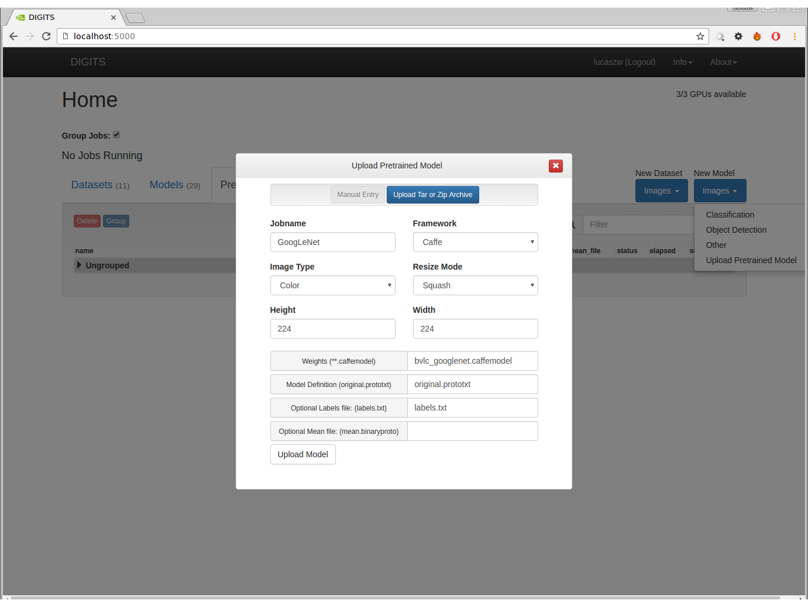
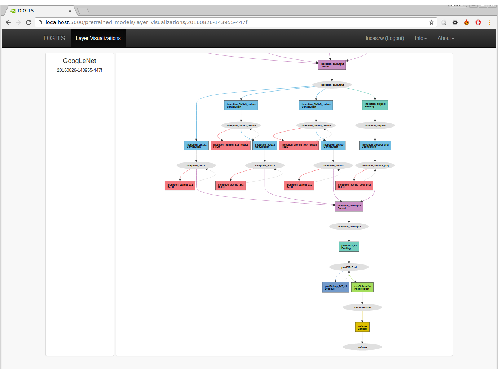
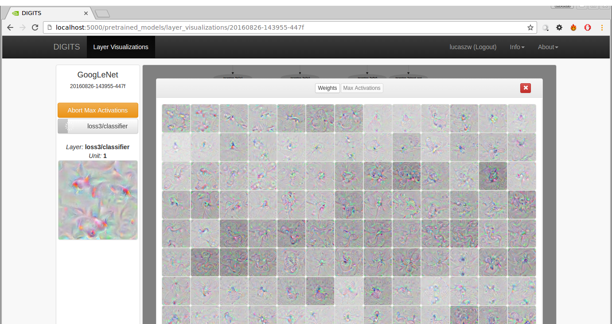

# Gradient Ascent

Table of Contents
=================
* [Uploading a Pretrained Model](#uploading-a-pretrained-model)
* [Selecting a Layer to Visualize](#selecting-a-layer-to-visualize)
* [Running Gradient Ascent](#running-gradient-ascent)

## Uploading a Pretrained Model

A pretrained model job primarily consists of the following:
- `weights file:` (.t7 for Torch or .caffemodel for Caffe)
- `model definition:` ( original.prototxt or model.lua)
- `input information:` like: Image Type (Colour or Greyscale), Resize Mode (Squash, Crop, etc), and Width and Height

To upload a pretrained model:
- `Navigate to Homepage`
- `Expand New Model (Images)` on top right of page body
- `Select "Upload Pretrained Model"`

## Selecting a Layer to Visualize

Once the pretrained model is uploaded, selecting the job with direct you to the layer visualizations page

- `Click "Pretrained Models" tab` on homepage body
- `Click on job `
- `Drag mouse` to layer you want to visualize

## Running Gradient Ascent

Only certain layers are likely to produce outputs. These are Convolutional Layers, Fully-Convolutional Layers, and Softmax
In `Caffe` They will have names like: `Convolution`, `Inner Product`, or `Softmax`
In `Torch` They will have names like: `Spatial Convolution`, `Linear`, or `Softmax`

- `Click Layer` in graph
- `Select Tab 2` in panel header
- `Click Run Max Activations` in left pane of page body

Outputs will be produced sequentially from the first unit to the last. The task will take some time to complete.

