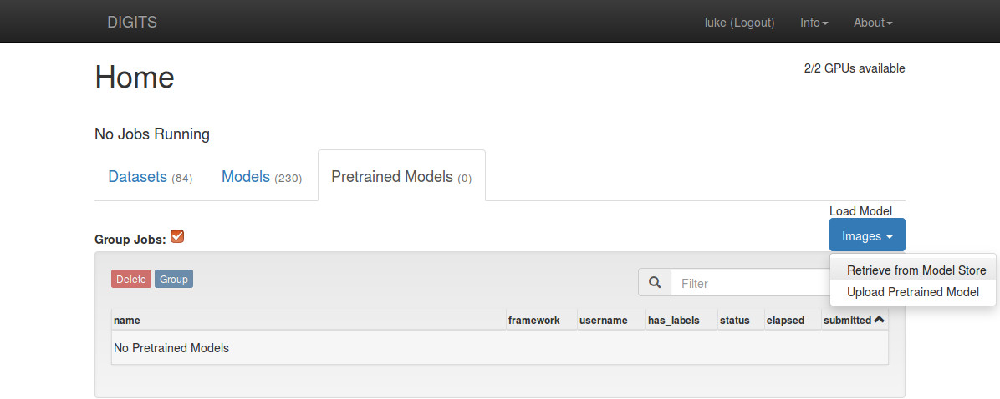
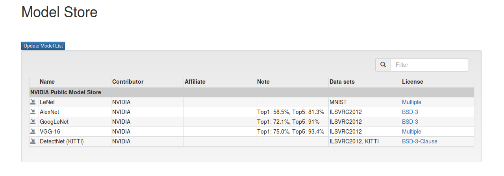
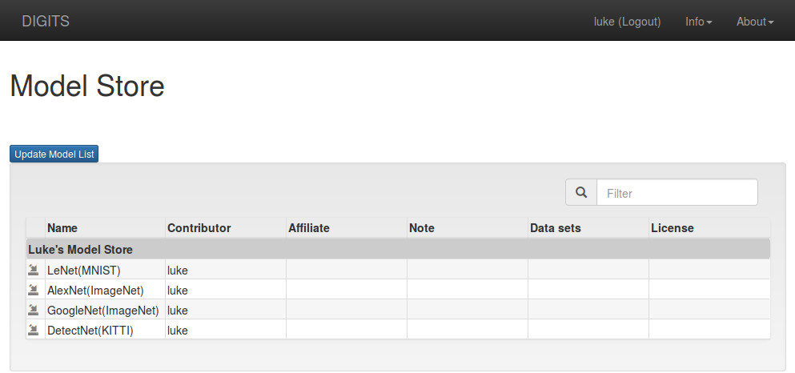

# Model Store

## Introduction

DIGITS 5.0 introduces the concept of a "model store," which is a collection of trained models that can be used as pre-trained weights to accelerate training convergence.
A DIGITS server can be configured to connect to one or more model stores to download these trained models from the store to the server.

By default, DIGITS is configured to connect to the official NVIDIA model store.
See instructions below for creating and connecting to your own store[s].

## Usage

From the DIGITS home page, click on "Pretrained Models", then "Load Model" > "Images" > "Retrieve from Model Store".



On the model store page, you will see a list of all the models available for download.
Click on the small download icon (first column) to download a model from the store to the DIGITS server.



After downloading a model, you can return to the homepage to see the list of pretrained models.
To make use of the downloaded model for training, select it as a "Pretrained Network" in the "New Model" form.
> NOTE: In order to automatically popluate to Python Layers the path of the Python layer file which comes with "Pretrained Models," you need to click "Customize" next to the selected "Pretrained Model."

## Create your own Model Store server

You are welcome to create your own model store and use it to share models with others.
Here we will explain how to use Python's built-in SimpleHTTPServer to do it, but you can easily do the same thing with Apache or Nginx or whatever else you like.

Create a new directory on the server you'll be using for your store.
Collect some snapshot tarballs from DIGITS training jobs that you'd like to use for your store.
Unzip each tarball into its own directory (each should have a file called `info.json`).
Finally, create a file in the top directory called `master.json`.
```sh
$ cat master.json
{
    "msg": "Luke's Model Store",
    "children": [
        "lenet",
        "alexnet",
        "googlenet",
        "detectnet"
    ]
}
```
Your directory structure should look something like this:
```sh
$ tree -F
.
├── alexnet/
│   ├── deploy.prototxt
│   ├── info.json
│   ├── labels.txt
│   ├── mean.binaryproto
│   ├── snapshot_iter_11310.caffemodel
│   ├── solver.prototxt
│   └── train_val.prototxt
├── detectnet/
│   ├── deploy.prototxt
│   ├── info.json
│   ├── mean.binaryproto
│   ├── original.prototxt
│   ├── snapshot_iter_19140.caffemodel
│   ├── solver.prototxt
│   └── train_val.prototxt
├── googlenet/
│   ├── deploy.prototxt
│   ├── info.json
│   ├── labels.txt
│   ├── mean.binaryproto
│   ├── snapshot_iter_33450.caffemodel
│   ├── solver.prototxt
│   └── train_val.prototxt
├── lenet/
│   ├── deploy.prototxt
│   ├── info.json
│   ├── labels.txt
│   ├── mean.binaryproto
│   ├── snapshot_iter_28140.caffemodel
│   ├── solver.prototxt
│   └── train_val.prototxt
└── master.json
```
Finally, use Python to start a server to serve these files
```sh
$ python -m SimpleHTTPServer
```
Now, restart your DIGITS server and configure it to connect to your new server:
```sh
$ DIGITS_MODEL_STORE_URL=http://localhost:8000 ./digits-devserver
```
To use multiple model stores, just separate the URLs with a comma:
```sh
$ DIGITS_MODEL_STORE_URL="http://developer.download.nvidia.com/compute/machine-learning/modelstore/5.0,http://localhost:8000" ./digits-devserver
```

> NOTE: If you have installed DIGITS with a deb package, see [UbuntuInstall.md](UbuntuInstall.md) for instructions about how to reconfigure and restart your server.

When you have configured everything properly, you should see something like this:


