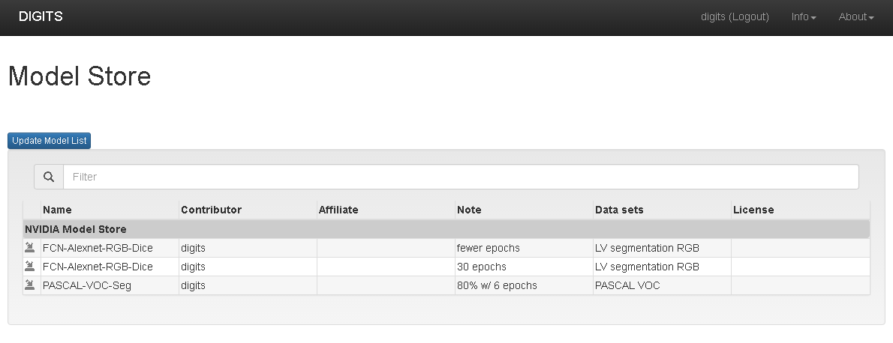
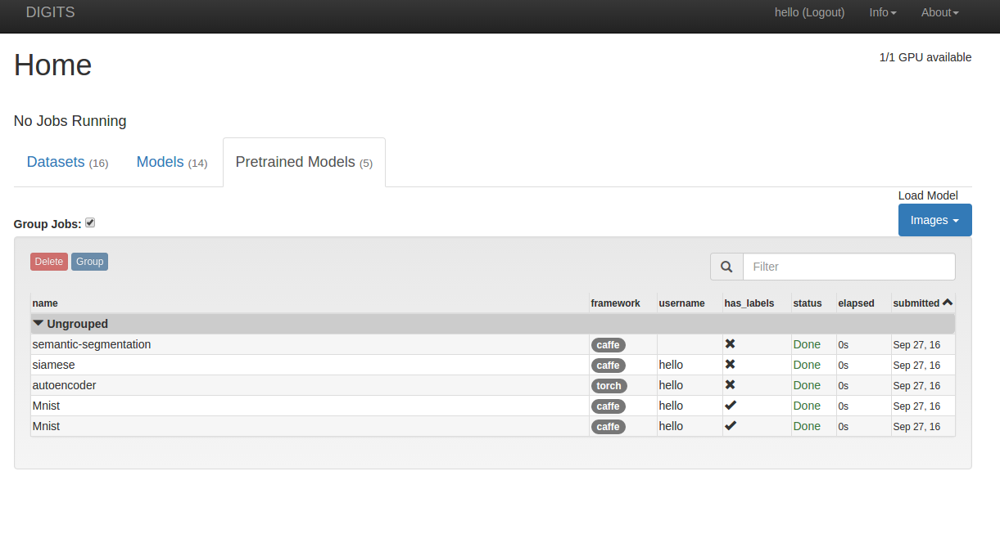

# Model Store


## Introduction
Model Store lists models in user-specified servers.
Users can imports models from Model Store into DIGITS.


## Setting up environment variable
The configuration of Model Store requires one environment variable DIGITS_MODEL_STORE_URL to be set.
NVIDIA plans to publish one public Model Store at http://developer.download.nvidia.com/compute/machine-learning/modelstore/4.5.0.
You can set up the environment variable with that url before launching DIGITS.
For example, run the following command in your Bash shell.
``` shell
export DIGITS_MODEL_STORE_URL='http://developer.download.nvidia.com/compute/machine-learning/modelstore/4.5.0'
```
If multiple model stores are available, specify their url's, separated by the comma (,).
``` shell
export DIGITS_MODEL_STORE_URL='http://localhost/mymodelstore,http://dlserver/teammodelstore'
```


## Browse and import model
First launch DIGITS.
Click Pretrained Models tab, and select 'Retrieve from Model Store' under 'Load Model.'
The new page shows models available in model stores.



Hover the Note field to show complete text.
Enter keyword in 'Filter list by' to limit results.
Click 'Update model list' button will retrieve the latest model list (see limitation).
Click 'Import' will import that model into DIGITS (may takes a few seconds, depends on network speed).

After successfully importing the model, DIGITS redirects the browser to Home page.



The Pretrained Models table will show the newly imported model.
At this moment, you can use that imported model like other pretrained models.


## Create your own Model Store server
You can host your Model Store via Python's built-in SimpleHTTPServer.
First, in shell, cd to your own Model Store.
Then run the following command to start server at port 8000.
```
python -m SimpleHTTPServer 8000
```

At the top directory, create a master.json file (if your server does not support Apache directory listing).
The following is a sample master.json file.
```
{"msg":"This is my own model store server.", "children":["Model01","Model02"]}
```
Model01 and Model02 are subdirectories containing the actual models.
Each model must at least include one info.json file, one weight file and one model file.
The info.json file is in the format of same file inside DIGITS downloaded model.
The subdirectory can optionally contain aux.json, which points to files not directly from DIGITS.
The following is a sample aux.json file.
```
{"license": "3-clause BSD license", "logo": "logo.png", "dataset":"MNIST"}
```
If `"license"` is defined, it will be shown on license field of that model.
The `license.txt` inside that subdirectory will be displayed when users clicking the license name.
`"logo"` is optional and once defined, DIGITS will display `logo.png` from the same subdirectory.


## Limitation
Some web server may limit frequent requests from the same machine to stop malicious activities.
Therefore, DIGITS implemented a cache mechanism to reduce server-to-server communication.
The button, 'Update model list', invalidates cache and retrieve meta data from all models.
