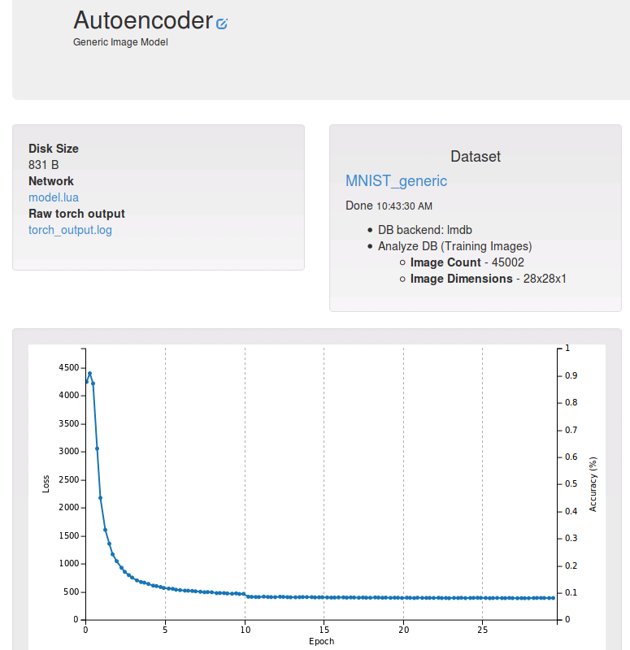

# Training an image autoencoder with DIGITS and Torch7

Table of Contents
=================
* [Introduction](#introduction)
* [Dataset creation](#dataset-creation)
* [Model definition](#model-creation)
* [Verification](#verification)

## Introduction

An image autoencoder may be used to learn a compressed representation of an image. An autoencoder comprises two parts:
- an encoder, which learns a representation of the image, using fewer neurons than the input image
- a decoder, which learns to reconstruct the original input from the compressed representation.

The output layer of the encoder is the input layer of the decoder. This layer can be understood as a bottleneck that constrains the autoencoder to learn a compressed representation of the input.
During training, the objective is to minimize the difference between the original input and the reconstructed input.

## Dataset Creation

The autoencoder may be created in DIGITS by using a generic dataset and model. To create a generic dataset, DIGITS expects to be provided with a set of LMDB-encoded databases.
If you followed the introductory walkthrough on [GettingStarted](../../docs/GettingStarted.md), you should have the MNIST dataset created in DIGITS already and DIGITS will have conveniently created the associated LMDB database and mean image file for you.
Click on your MNIST image classification model to display dataset information: this will allow you to find the path to the job directory which includes the train database and mean image file:


In this example the path is `/fast-scratch/gheinrich/ws/digits/digits/jobs/20151111-210842-a4ec`.

The next step is to create a generic dataset that DIGITS can use to train a generic model on. To this avail, click on `New Dataset\Images\Other` on the main page:


In the generic dataset creation form you need to provide the paths to the train database `.../jobs/20151111-210842-a4ec/train_db` and the mean image `.../jobs/20151111-210842-a4ec/mean.binaryproto`. Other fields can be left blank:


## Model creation

Now that you have a generic dataset to train on, you may create a generic model by clicking on `New Model\Images\Other` on the main page:


Select the dataset you just created and under the `Custom network` tab, select `Torch`. There you can paste the following network definition:
```lua
local autoencoder = nn.Sequential()
autoencoder:add(nn.MulConstant(0.00390625))
autoencoder:add(nn.View(-1):setNumInputDims(3))  -- 1*28*8 -> 784
autoencoder:add(nn.Linear(784,300))
autoencoder:add(nn.ReLU())
autoencoder:add(nn.Linear(300,50))
autoencoder:add(nn.ReLU())
autoencoder:add(nn.Linear(50,300))
autoencoder:add(nn.ReLU())
autoencoder:add(nn.Linear(300,784))
autoencoder:add(nn.View(1,28,28):setNumInputDims(1)) -- 784 -> 1*28*28

function autoencoderLabelHook(input, dblabel)
    -- label is the input
    return input
end

-- return function that returns network definition
return function(params)
    return {
        model = autoencoder,
        loss = nn.MSECriterion(),
        trainBatchSize = 64,
        validationBatchSize = 100,
        labelHook = autoencoderLabelHook,
    }
end
```

This is the definition of a simple linear autoencoder which learns to compress an input of 784 nodes into a layer of just 50 nodes. Note how the model is symmetrically defined,
with the encoder and decoder at opposite sides of the smallest layer of 50 nodes.

Since this is unsupervised training, a hook is required to tell DIGITS what to compare the network output against: here we are just setting the target label to be equal to
the input image through this function:

```lua
function autoencoderLabelHook(input, dblabel)
    -- label is the input
    return input
end
```

We are using the MSE loss criterion in order to minimize the difference between the input and the reconstructed image.

After training for 30 epochs the loss function should look similar to this:



## Verification

Now we can assess the quality of the autoencoder. On the model page, select an image from the MNIST test set (one that the network has never seen during training) and
enable network visualizations then click `Test One`:


A new window will appear showing the original image:


The normalized image after mean subtraction and scaling (this is the image that the network will try to reconstruct):


The compressed representation of the image (50 nodes out of the original 784 nodes):


The reconstructed image, which looks similar to the normalized image:


