# Image segmentation using DIGITS

Table of Contents
=================
* [Introduction](#introduction)
* [Dataset creation](#dataset-creation)
* [Model creation](#model-creation)
    * [Using Caffe](#using-caffe)
    * [Using Torch7](#using-torch7)
* [Verification](#verification)

## Introduction

This tutorial will walk you through using DIGITS to create a simple segmentation neural network.
In this particular example we will create small images of random triangles and will teach the network to segment the image between the inside and the outside of those triangles.
For example, the input to the network might look like:

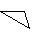

And the targeted output would look like:

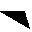

## Dataset Creation

The dataset may be created using the Image Processing extension in DIGITS.
This extension creates datasets where network inputs and labels are images.
To this avail, a folder of images images and a folder or labels are required.
Optionally, separate image folders may be used in order to create a validation set.
Alternatively, DIGITS can automatically set aside a fraction of the images for validation purpose.

In order to create the synthetic images of triangles and their corresponding ground truth, you will use a Python script located in `/examples/segmentation/create_images.py`.
By default the script creates 10000 pairs of `32x32` images into the specified directory:
```sh
$ ./create_images.py out
```

This script also creates one larger image which is a `10x10` grid of random images.


On the DIGITS home page, select the `Datasets` tab then click `Images>Processing`:

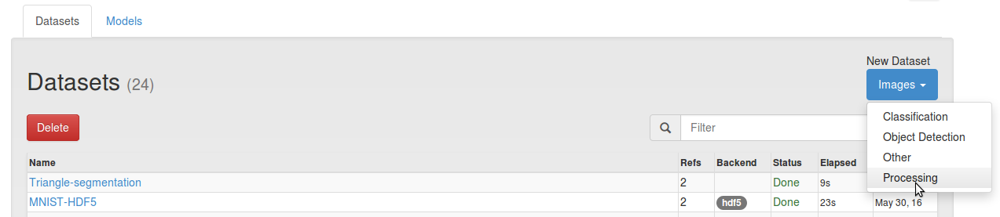

On the dataset creation page, specify the paths to the input and target directories that were just created by `create_images.py`.
Other fields may be left to their default value.
When you are ready, give your dataset a name then click the `Create` button:

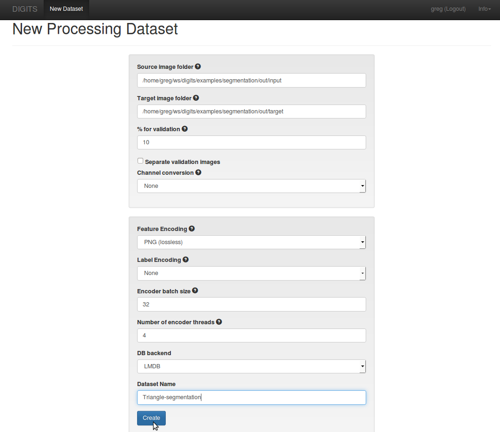

## Model Creation

On the DIGITS home page, select the `Datasets` tab then click `Images>Processing`:

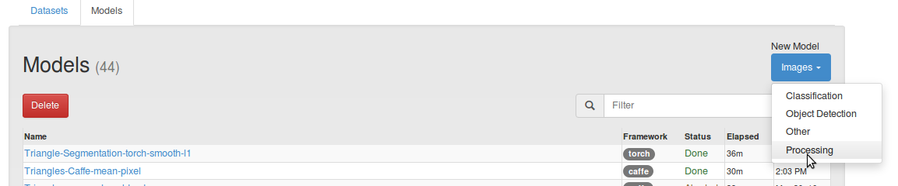

On the model creation page, select the dataset that was created in the previous section.
In the `Data Transformations` section, set `Subtract Mean` to `Pixel`.
Set the number of training epochs to `150`.

### Using Caffe

Select the `Custom network` tab then click `Caffe`.
In the text area copy/paste the contents of this [Caffe model](segmentation-model.prototxt).
Set the base learning rate to `1e-7`.

You may click `Visualize` to review the network topology:

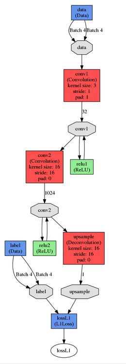

### Using Torch7

Select the `Custom network` tab then click `Torch`.
In the text area copy/paste the contents of this [Torch model](segmentation-model.lua).
Set the base learning rate to `0.001`.

### Some words on the model

The proposed network is a simple Fully Convolutional Network (FCN).
The first convolutional layer has 32 `3x3` filters and stride/padding are chosen to produce a tensor with identical width and height as the input image.
This layer is designed to learn basic features like corners and edges.
The second convolutional layer has 1024 large `16x16` filters with 16-pixel stride.
In a way, this layer acts very much like a fully-connected layer: every `16x16` block in the input produces 1024 outputs, just like a fully-connected layer would on a `16x16` image.
The difference is we're generating those 1024 outputs for each `16x16` square, which makes it possible to process input images of any dimensions.
The last layer is a deconvolutional layer, which upsamples the output from the previous layer to produce an image of `16x16` pixels for each corresponding `16x16` block in the input image.
All in all, this network produces an output that has the same dimensions as the input if the input dimensions are multipels of 16.
Various loss layers may be used for this network e.g. `L1`, `Smooth L1`, `L2`, etc.

### Training

When you are ready, click the "Create" button.

When training completes, your network loss may look like:
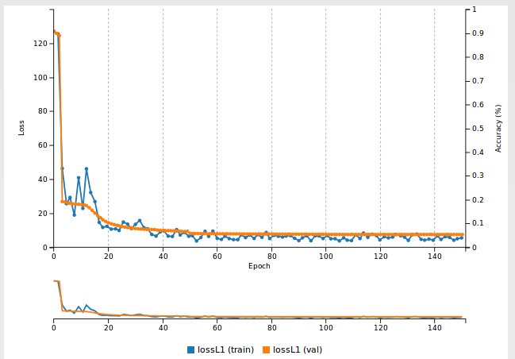

## Verification

The `create_images.py` script created many images we can use for testing.
You may also run the command again to produce new images.
To help visualize the output of the network, select the `Image` visualization method and set `Pixel Conversion` to `clip`:

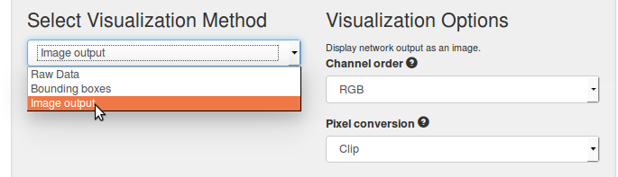

You can test images individually with `Test One`:

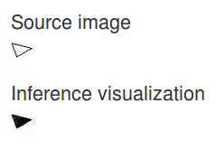

Or you can test the validation database entirely (append `val_db/features` to the dataset job folder to retrieve the path to the validation image database):

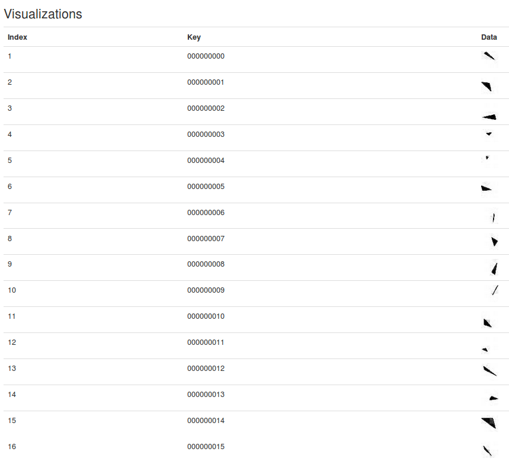

Now comes the real fun part: we have trained a Fully Convolutional Neural network that can take inputs of any dimensions.
Therefore we can exercise the network on larger images.
On the model page, in the `Inference Options`, tick the box `Do not resize input images(s)`.

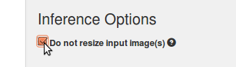

Then in `Test One Image` select the grid image that was created by `create_images.py` in the output directory.
When you are ready, click `Test One`.
You may see something like below:

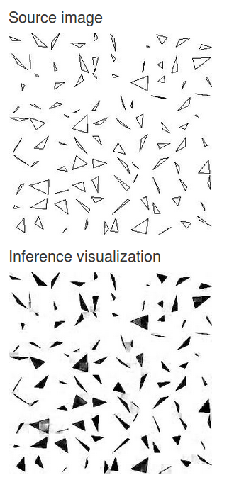
