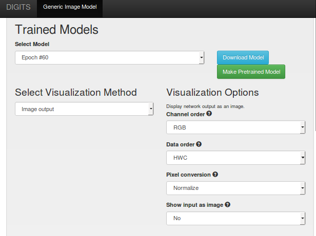

# Using DIGITS to train a Generative Adversarial Network

Table of Contents
=================
* [Introduction](#introduction)
* [Preliminary installation steps](#preliminary-installation-steps)
* [Handwritten digits](#handwritten-digits)
    * [Creating the dataset](#creating-the-dataset)
    * [Training the model](#training-the-model)
    * [Sampling the model](#sampling-the-model)
    * [Training an encoder](#training-an-encoder)
* [Celebrity faces](#celebrity-faces)
    * [Downloading the CelebA dataset](#downloading-the-celeba-dataset)
    * [Creating the CelebA dataset](#creating-the-celeba-dataset)
    * [Training the CelebA model](#training-the-celeba-model)
    * [Training a CelebA encoder](#training-a-celeba-encoder)
    * [Generating attribute vectors](#generating-attribute-vectors)
    * [Sampling the CelebA model](#sampling-the-celeba-model)
        * [Setting image attributes](#setting-image-attributes)
        * [Analogy grid](#analogy-grid)
    * [Embeddings visualization](#embeddings-visualization)

**Disclaimer:**
This walk-through makes use of experimental features in DIGITS.
Please do not report issues on the main DIGITS fork.

## Introduction

Generative Adversarial Networks (GAN) were introduced by Ian Goodfellow in [Generative Adversarial Networks](https://arxiv.org/abs/1406.2661), Goodfellow, 2014.
GANs learn a data probability distribution under unsupervised learning.
In practice a GAN learns to draw from a dataset probability distribution in order to generate data.
To this avail, a GAN comprises two pieces: a Generator that generates data and a Discriminator that learns to discriminate between "real" data (from the dataset) and "fake" data (those that were generated).
A latent representation of the data is learnt by ways of a feature vector called `z`.
Through a number of fully-connected and transpose convolutional layers, the generator learns to generate images from `z`.
During training, `z` is sampled from a random distribution.
During inference, `z` may be specified to generate images with carefully chosen attributes.

The typical training loop comprises the following phases:
- optimize the discriminator on real samples (make it classify them as such),
- draw `z` from a random distribution and have the generator create the corresponding image,
- optimize the discriminator on generator samples (make it classify them as such),
- optimize the generator (make it fool the disciminator).

Other papers of interest:
- [Unsupervised Representation Learning with Deep Convolutional Generative Adversarial Networks](https://arxiv.org/abs/1511.06434), Radford, 2015.
- [Sampling Generative Networks](https://arxiv.org/abs/1609.04468), White, 2016.

## Preliminary installation steps

You will need a version of DIGITS that includes this document.

Tensorflow may be installed by doing for example (refer to the Tensorflow homepage for more up-to-date install instructions):

```sh
$ export TF_BINARY_URL=https://storage.googleapis.com/tensorflow/linux/gpu/tensorflow_gpu-0.12.1-cp27-none-linux_x86_64.whl
$ pip install --upgrade $TF_BINARY_URL
```

If you haven't done so already, install the top-level DIGITS module:
```sh
$ pip install -e $DIGITS_ROOT
```

The GAN data and visualization plugins for DIGITS may be installed by doing:
```sh
$ pip install -e $DIGITS_ROOT/plugins/data/gan/
$ pip install -e $DIGITS_ROOT/plugins/view/gan/
```

## Handwritten digits

Here we will use the MNIST dataset. You don't need labels to train a GAN however if you do have labels, as is the case for MNIST, you can use them to train a **conditional** GAN.
In this example, we will condition our GAN on the class labels.
Conditioning a GAN in this way is useful because this allows us to dissociate classes from other learnable features that define the "style" of images.
In practice, in our network we will concatenate a one-hot representation of labels to the activations of every layer in both the generator and the discriminator.

### Creating the dataset

If you already followed the [GettingStarted](../../docs/GettingStarted.md) example, you should already have a classification dataset for MNIST.
We will reuse the LMDB files that were already created for the MNIST classification dataset to create a new generic dataset.
Creating a generic dataset is required here because GANs do not fall into the category of classification datasets and require specific plug-ins.

Open the classification dataset page and make good note of the job directory for your MNIST classification dataset:


On the home page, click `New Dataset>Images>Other`.
Then specify the path to the training images LMDB and the path to the mean image protobuf file:


Give your dataset a name and click "Create".

### Training the model

On the home page, click `New Model>Images>Other`.
- select your dataset,
- set the number of epochs to 60,
- set mean subtraction to `None`,
- select `ADAM` solver,
- select learning rate to `2e-4`,
- use only 1 GPU for this model.

In the `custom network` tab, select `Tensorflow` and copy-paste this [network definition](./network-mnist.py).

You can click `Visualize` to browse the model graph (this only works in Chrome):


Name your model `GAN-MNIST` and click `Create`.

> Note: when training a neural network it is typical to expect the loss to go down and see there an indication that the model is learning well.
This is not the case in a typical GAN.
If the loss of the discriminator is very low, this means that the generator is not doing a good job at fooling the discriminator.
Conversely, if the loss  of the generator is too low, this means the discriminator is not doing a good job at detecting fake samples.
In a balanced set-up, equilibrium is reached when the generator can fool the discriminator in 50% of cases.
From the definition of the cross entropy loss this corresponds to a loss value of `-math.log(0.5)=0.69`.


Also note that we've added a metric in this model to track the `Chi-square` distance between the histogram of real pixel values and the histogram of generated pixel values.
This is used as a proxy indication that the generator has learnt a good propability distribution.
Getting this distance to go low is a necessary yet insufficient condition.
Note however how the `Chi-square` metric is going down below:


You can also open Tensorboard and point to the `tb` sub-folder of the job directory to see samples of generated and real images (under the `images` tab).

To start Tensorboard:

```sh
$ tensorboard --logdir <job_dir>/tb/
```

To open Tensorboard in a browser, open `http://localhost:6006`.

In the below image, the first row shows generated images.
The second row shows real images (from the dataset).
This is updated periodically during training so you can monitor how well the network is doing.


### Sampling the model

We will see how to sample `z` to produce images.
On the model page, select the `GAN` inference method and the `GAN` inference form.
In the inference form, select the `MNIST Class sweep` task.


Click `Test`.
This shows a grid of digits, all of them were sampled using the same randomly generated `z`.
The `z` vector is then concatenated with various shades of labels, using spherical interpolation.
Every column shows how a digit is slowly morphing into the next digit:


This can also be visualized with an animated gif:


Now in the inference form, select `MNIST Style sweep` and click `Test`.
This shows a new grid of digits.
Every column shows how a digit is slowly morphing from one "style" (i.e. one randomly generated z vector) into another style:


### Training an encoder

In order to avoid picking `z` randomly, we can train an encoder to generate the `z` vector, given an input image.
Here we will fine-tune the discriminator such that it becomes an encoder:
- we replace the last layer of the discriminator with a fully-connected layer that has as many neurons as there are numbers in `z` (100 in our case),
- we reverse the order of things in our GAN: the output of the discriminator/encoder is now connected to the input of the generator,
- we change the loss function: we are now using the L2 distance between the generated image and the image in the dataset.

> Note: the parameters of the generator must be frozen when training the encoder.

To train the encoder, do this:
- clone the `GAN-MNIST` model
- in the `Previous networks` tab, select the GAN model, select the last epoch then click `Customize`
- use this [network description](./network-mnist-encoder.py)

Name your model `GAN-MNIST-Encoder` and click `Create`.

Notice that the loss converges smoothly towards a low plateau:


Now that we have an encoder we can encode an image and find the corresponding `z` vector.
On the `GAN-MNIST-Encoder` page,
- select the `GAN` visualization method and the `MNIST encoder` task,
- upload an image of a `3`
- click `Test One`


>Note: in this GAN-encoder, class "3" is hard-coded in the encoder model **during inference**.
If you want to encode another class you will need to manually update this line in the model description: `self.y = tf.to_int32(3*tf.ones(shape=[self.batch_size]))`

On the resulting page, you can see the input image (left), the reconstructed image (middle), and the corresponding `z` vector (right):


Now that we have a `z` vector, we can do a class sweep for that particular "style":
- copy the encoded `z` vector from the encoder.
- move to the `GAN-MNIST` model page.
- select the `GAN` visualization method and the `Grid` task,
- select the `GAN` inference form and the `Class sweep` task,
- paste the encoded `z` vector into the field:


Now click `Test` and you will see a class sweep using the particular style that you specified:


## Celebrity faces

### Downloading the CelebA dataset

The Celebrity Faces (a.k.a. "CelebA") dataset is available from this [location](http://mmlab.ie.cuhk.edu.hk/projects/CelebA.html).
Download [img/img_align_celeba.zip](https://drive.google.com/drive/folders/0B7EVK8r0v71pTUZsaXdaSnZBZzg) and [Anno/list_attr_celeba.txt](https://drive.google.com/drive/folders/0B7EVK8r0v71pOC0wOVZlQnFfaGs).
Extract the ZIP file into a local folder.

### Creating the CelebA dataset

On the home page, click `New dataset>Images>GAN`.
Specify the location of the attributes and images:

.

Leave other settings in their default state, name your dataset `CelebA-64` then click `Create`.

You can explore the dataset using the `Explore` button on the model page.
See below for some image samples:


### Training the CelebA model

This model is very similar to the MNIST one but differs slightly:
- it receives colour 64x64 images,
- it has a few more layers,
- it is not conditioned on labels.

On the home page, click `New Model>Images>Other`.
- select your dataset,
- set the number of epochs to 60,
- set the batch size to 64,
- set mean subtraction to `None`,
- select `ADAM` solver,
- select learning rate to `5e-4`,
- use only 1 GPU for this model.

In the `custom network` tab, select `Tensorflow` and copy-paste this [network definition](./network-celebA.py).

Name your model `GAN-CelebA` then click create.

You may notice that the learning curves don't converge towards 0.69 as smoothly as in the MNIST case.
This is because the generator is overpowered by the discriminator.
This is not necessarily an issue as we will see later.


### Training a CelebA encoder

Proceed as in the MNIST example but use this [network description](./network-celebA-encoder.py).

### Generating attribute vectors

The CelebA dataset comes with 40 different attributes for each image.
We can use these labels to generate characteristic `z` vectors for each attribute.
A way to do this is to compute the average `z` vector for images that have the attribute and subtract the average `z` vector for images that do not have the attribute.
This can be done with the `gan_features.py` script:

```sh
$ export DIGITS_JOBS_DIR=/path/to/digits/jobs
$ export GAN_ENCODER_JOB_ID=20170202-100209-72af  # replace this with the Job ID of your GAN-CelebA-Encoder
$ ./examples/gan/gan_features.py -j $DIGITS_JOBS_DIR $GAN_ENCODER_JOB_ID -g 0
```

Running the above command will sweep through the 200k images in the dataset and create a file named `attributes_z.pkl` that includes the 40 characteristic `z` vectors.

### Sampling the CelebA model

#### Setting image attributes

You can find `z` vectors by encoding images from the dataset through the GAN-CelebA-Encoder model.
- move to the model page for your `GAN-CelebA-Encoder`,
- select the `GAN` visualization method, select the `CelebA Encoder` task,
- select the `GAN` inference form, select the `Encode list` task,
- specify the path to your attributes text file and the path to the image folder.


Click `Test`. You may see something like:

.

Every row is showing the input image (left), the reconstructed image (center) and the corresponding z vector (right).

Now if you pick a `z` vector, you can add/remove attributes to this image:
- open the `GAN-CelebA` model page,
- select the `Image output` visualization method and set the `Data order` to `HWC`:



- select the `GAN` inference form and select the `CelebA - add/remove attributes` task,
- specify the location of the attributes file you created with `gan_features.py`.
- paste the `z` vector you found when using the `Encode list` task above.
- click `Add row` a number of times to create new rows.
Each row will generate an image with the corresponding attributes.
If you leave all cells in a row blank, you will get the original image.
If you set `Black Hair` to `+1` and `Blond Hair` to `-1`, this will transform a blond person into a person with dark hair.
If you set `Smiling` to `-1` this will make a smiling person... not smile.

See for example:


This will generate these images:


#### Analogy grid

If you pick 3 `z` vectors you can generate an analogy similar to `king - man + woman = queen`.
To experience this:
- select the `GAN` visualization method, select the `Grid` task,
- select the `GAN` inference form, select the `CelebA - analogy` task,
- set the `source`, `sink 1` and `sink 2` vectors.

This will create a grid with the following analogy: `destination = sink 1 + sink 2 - source` with:
- `source` in top-left corner,
- `sink 1` in top-right corner,
- `sink 2` in bottom-left corner,
- `destination` in bottom-right corner.


This might result in a grid like this:

```
  man with blond hair looking straight
+ woman with dark hair looking to her left
- woman with blond hair looking straight
= man with dark hair looking slightly to his left
```

Pretty good, heh?


The grid can also be visualized through an animated image:


### Embeddings visualization

You might have noticed another byproduct of the `gan_features.py` script: a file named `embeddings.pkl`.
This file contains `z` vectors for the first 10k images in the CelebA dataset.
We can use this to display image embeddings in Tensorboard:

```sh
$ ./gan_embeddings.py embeddings.pkl
$ tensorboard --logdir ./gan-tb/
```

Now open a browser on `http://localhost:6006`.
In the `Embeddings` tab you will see something similar to this:


