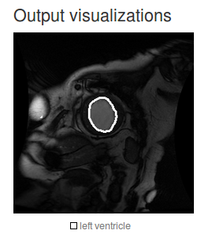

# Using DIGITS to train a medical image segmentation network

Table of Contents
=================
* [Introduction](#introduction)
* [The Sunnybrook plug-in](#the-sunnybrook-plug-in)
* [Dataset creation](#dataset-creation)
* [Model creation](#model-creation)
    * [FCN-Alexnet](#fcn-alexnet)
    * [Dice metric](#dice-metric)
    * [Transfer learning](#transfer-learning)
* [Further improvements](#further-improvements)
    * [FCN-8s](#fcn-8s)
    * [Dice loss](#dice-loss)
    * [Data augmentation](#data-augmentation)

## Introduction

In this tutorial we will see how DIGITS may be used for medical imaging.
In doing so, we will see how to use a custom plug-in to load data into DIGITS.
We will train an image segmentation neural network and learn how to implement a custom metric by using a Caffe Python layer.
We will also see how transfer learning can help in cases where the dataset is too small to reach the desired accuracy.
Lastly, we will see how a finer segmentation model helps address the issue of coarse segmentation contours.

We will use the [Sunnybrook Left Ventricle Segmentation Challenge Dataset](http://smial.sri.utoronto.ca/LV_Challenge/) to train a neural network to segment the Left Ventricle out of MRI images.
The dataset was originally published in:

> Radau P, Lu Y, Connelly K, Paul G, Dick AJ, Wright GA. “Evaluation Framework for Algorithms Segmenting Short Axis Cardiac MRI.” The MIDAS Journal – Cardiac MR Left Ventricle Segmentation Challenge, http://hdl.handle.net/10380/3070

The dataset consists of 16-bit MRI images in DICOM format and expert-drawn contours in text format (coordinates of contour polylines).
A sample image/label pair may look like:


## The Sunnybrook plug-in

DIGITS plug-ins are thin layers that users can implement to load data when they are not in a format that DIGITS natively supports.
See the code for the [Sunybrook plug-in](/plugins/data/sunnybrook/).

The Sunnybrook plug-in reads 16-bit images from DICOM files (those images are the input to the network we will train) and creates black-and-white images out of the .txt files that delineate the contours of the left ventricle (those black-and-white images will be our labels).

If you haven't done so already, install the main DIGITS package.
This only needs to be done once:

```sh
$ pip install -e $DIGITS_ROOT
```

You may now install the Sunnybrook plug-in:

```sh
$ pip install $DIGITS_ROOT/plugins/data/sunnybrook/
```

Restart DIGITS for the change to take effect.

## Dataset creation

You will need to register on the [Cardiac MR Left Ventricle Segmentation Challenge web site](http://smial.sri.utoronto.ca/LV_Challenge/) to receive download links.
You will need to download two archives:
- `LV Segmentation Challenge Training Datasets` (787MB)
- `Contours for Part 3` (581kB)

Once you have downloaded the data, expand the archives into a location that DIGITS can access (if you are using .deb packages, make sure the data can be read by user `www-data` on your system).

On the DIGITS home page, select the dataset tab then `New dataset > Images > Sunnybrook LV segmentation`:


In the dataset creation form:
- set `image folder` to the `challenge_training` folder
- set `contour folder` to the `Sunnybrook Cardiac MR Database ContoursPart3` folder
- set `feature encoding` to `none`
- set `encoder batch size` to `1`
- set `dataset name` to `Sunnybrook-grayscale`


When you are ready, click create.

After the dataset is created, you may review the data shapes on the dataset page.
You can see that input and label images are all 256x256 grayscale images.


## Model creation

On the DIGITS home page, select the model tab then `New model > Images > Sunnybrook LV segmentation`:


### FCN-Alexnet

FCN models were first published on:

> Fully Convolutional Models for Semantic Segmentation Jonathan Long, Evan Shelhamer, Trevor Darrell CVPR 2015 arXiv:1411.4038

We will use FCN-Alexnet, which was already introduced to DIGITS users on the [semantic segmentation example](../semantic-segmentation/).

> REMINDER: AlexNet is a classification network but with a few minor modifications it can be converted into a segmentation network. See the above paper for more details.

In the model creation form:
- select the Sunnybrook-grayscale dataset you just created
- set the number of epochs to 5
- set the mean subtraction to `none`
- set the base learning rate to 1e-4
- select the `custom network` tab then paste the [prototxt](../semantic-segmentation/fcn_alexnet.prototxt) from the semantic segmentation example.
- name your model `FCN-Alexnet-Sunnybrooke`

You will also need to edit the definition of `FCN-Alexnet`.
Remember that in the semantic segmentation example, there are 21 different classes.
In this example, we only have two classes (background and left ventricle).
It is straightforward to adjust the model description to train on a different number of classes.
To this avail:
- in the `score_fr` layer, set `num_output` to `2`
- in the `upscore` layer, set both `num_output` and `group` to `2`

When you are ready, click `Create`.

After training for a few minutes, you should see that the model reaches an accuracy of over 98%.
This means that 98% of pixels are correctly predicted as belonging to either the left ventricle or the background.
This is very good!


Now let us see how the model performs on an image from the validation set:
- scroll down to the bottom of the model page
- select the `Image segmentation` visualization method
- in `Test a record from validation set` select `SC-HF-NI-3`
- check `Show visualizations and statistics`
- click `Test`.

A new page will open, which will show an overlay of the class delineations over the input image.
The output should look like:


Can you see the delineations of the Left Ventricle on this image?
Oh no, the network didn't find a single pixel of the left ventricle!
How is that possible?
It turns out that in this dataset, less than 2% of pixels represent the left ventricle.
The network has just lazily learnt to classify everything as background.
This is a typical "class imbalance" problem.

### Dice metric

We need a better metric to evaluate the performance of the model.
A popular metric for this kind of problems is the [Dice coefficient](https://en.wikipedia.org/wiki/S%C3%B8rensen%E2%80%93Dice_coefficient).
The Dice coefficient is a measure of the overlap between the network prediction and the ground truth.
A value of 1 means a perfect match.
A value of 0 means a complete mismatch between the prediction and the ground truth.

Let us add this metric to our model.
By default, Caffe, the underlying Deep Learning framework we are using, does not support this metric.
However this is easily added through a custom Python layer.
Take some time to review the code below and save it into a file called `dice.py`:

```python
import random

import numpy as np
import caffe

class Dice(caffe.Layer):
    """
    A layer that calculates the Dice coefficient
    """
    def setup(self, bottom, top):
        if len(bottom) != 2:
            raise Exception("Need two inputs to compute Dice coefficient.")
        # compute sum over all axes but the batch and channel axes
        self.sum_axes = tuple(range(1, bottom[0].data.ndim - 1))

    def reshape(self, bottom, top):
        # check input dimensions match
        if bottom[0].count != 2*bottom[1].count:
            raise Exception("Prediction must have twice the number of elements of the input.")
        # loss output is scalar
        top[0].reshape(1)

    def forward(self, bottom, top):
        label = bottom[1].data[:,0,:,:]
        # compute prediction
        prediction = np.argmax(bottom[0].data, axis=1)
        # area of predicted contour
        a_p = np.sum(prediction, axis=self.sum_axes)
        # area of contour in label
        a_l = np.sum(label, axis=self.sum_axes)
        # area of intersection
        a_pl = np.sum(prediction * label, axis=self.sum_axes)
        # dice coefficient
        dice_coeff = np.mean(2.*a_pl/(a_p + a_l))
        top[0].data[...] = dice_coeff

    def backward(self, top, propagate_down, bottom):
        pass
```

Use the Clone button on the model that you just trained to create a new model with the same settings.
In the custom network definition, add this definition of the `Dice` layer:

```
# Dice coefficient
layer {
    type: 'Python'
    name: 'dice'
    bottom: 'score'
    bottom: 'label'
    top: 'dice'
    python_param {
      module: "digits_python_layers"
      layer: "Dice"
    }
    exclude { stage: "deploy" }
}
```

In the `Python layers` menu, check `client-side file` then upload `dice.py`.
Name your model `fcn_alexnet-sunnybrook-with_dice`.
Finally, click Create.

Now there is a `dice` metric on the training curve:


However, as you can see, the Dice coefficient does not exceed zero, even after training for many epochs.
Our model did not learn anything useful but at least we now have a metric to figure that out.

### Transfer learning

One of the reasons why the model performs badly is the size of the dataset, which is rather small.
A common way of dealing with this issue is to do "transfer learning" i.e. re-use knowledge that the model has acquired when training on another dataset and apply that knowledge to a different task.

We have already seen in the semantic segmentation example how to use a pre-trained Alexnet model that was trained on the 1.2M ImageNet database (ILSVRC2012).
Let us know re-use the `.caffemodel` that we generated in the semantic segmentation example.
One slight complication though is the fact that ILSVRC2012 is a color image database and in this example we have grayscale images.
If we use the pre-trained FCN-Alexnet on our dataset, Caffe will refuse to proceed as the shapes of the parameters in our model are different from those from the pre-trained model.
If you attempt to do so, you will get an error like:


In order to overcome this issue, let us just re-create the dataset as a set of RGB images: we can use the Sunnybrook plug-in for this:
- go to your `Sunnybrook-grayscale` dataset page
- click the `Clone` button
- set `channel conversion` to `RGB`
- name your dataset `Sunnybrook-RGB`
- click `Create`

Now that we have a dataset of RGB images, we can easily re-use the pre-trained FCN-Alexnet:
- go to your `fcn_alexnet-sunnybrook-with_dice` model page
- click the `Clone` button
- select the `Sunnybrook-RGB` dataset
- in `pretrained weights` point to the location of the FCN-Alexnet pre-trained model you created in the semantic segmentation example
- remember to re-upload your `dice.py` file
- name your model `FCN-Alexnet-Sunnybrooke_with_dice-pretrained`
- set the number of training epochs to `30`

When you are ready, click `Create`.
You will see that after a small number of epochs, the Dice coefficient starts increasing to finally exceed 0.6:


Now we can test the same image again and see how the model performs:


You can use the opacity/mask sliders to see the delineations more clearly.
As you can see, the result is much better but the contours are very coarse and there is room for improvement.

## Further improvements

The following sections are left as excercises to the reader.

### FCN-8s

We saw in the previous section that FCN-Alexnet produces very coarse outputs: the segmented area is very edgy, while left ventricles tend to look like circles.
The main reason behind this is that FCN-Alexnet makes one prediction per 32x32 block, which then gets upscaled.
In FCN-8s (from Long et al. 2015), predictions are made at various scales, down to 8x8 blocks.
This produces much smoother segmentation contours.
Using the same techniques as in the semantic segmentation example, it is straightforward to use FCN-8s in DIGITS.
With FCN-8s - all other things being equal - the Dice metric should exceed 0.85:


During inference, you will be able to see that the model makes much finer predictions:



### Dice loss

In the previous sections, we added a layer to print the Dice metric during training.
For very unbalanced datasets such as the one we are using in this example, the logistic loss is not well suited as it penalizes all classes in the same way.
It would make sense to penalize the network more strongly when it predicts a left ventricle pixel to be background.
Alternatively, we could implement the `backward()` method of the Dice Python layer and make this layer a loss layer.
This would allow us to directly aim for this metric during training.

### Data augmentation

FCN-8s exhibits some amount of overfit: the training loss is consistently lower than the validation loss.
In order to reduce overfit, we can artificially augment the training dataset by applying random perturbations (color, contract changes, etc.).
