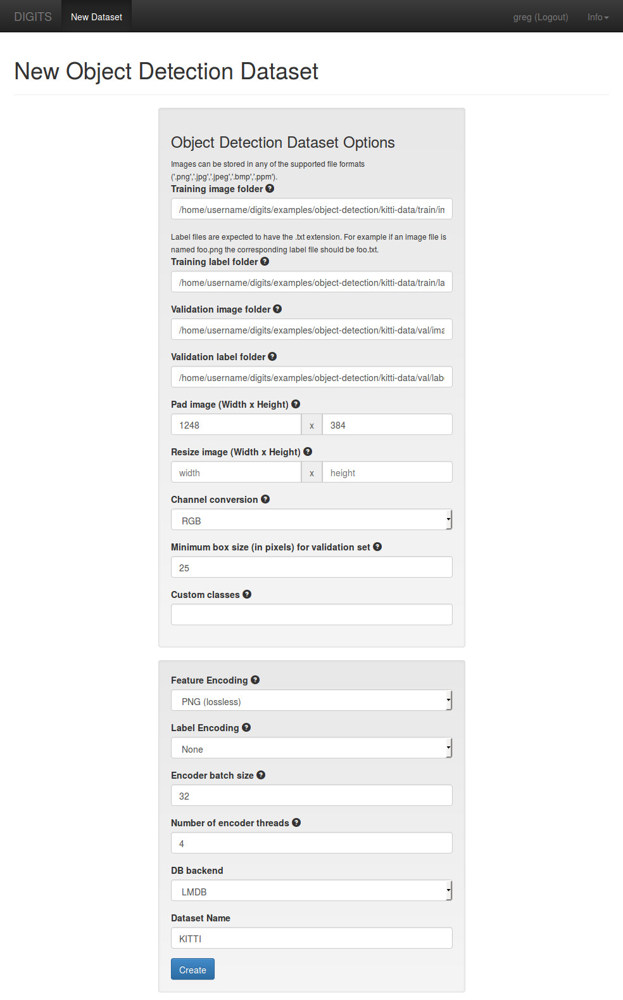

# Using DIGITS to train an Object Detection network

Table of Contents
=================
* [Introduction](#introduction)
* [Dataset creation](#dataset-creation)
    * [Preparing the data](#preparing-the-data)
    * [Loading the data into DIGITS](#loading-the-data-into-digits)
* [Model creation](#model-creation)
    * [DetectNet](#detectnet)
    * [Training DetectNet in DIGITS](#training-detectnet-in-digits)
* [Verification](#verification)

## Introduction

In this tutorial we will see how DIGITS may be used to train an Object Detection neural network using the Caffe back-end.
In this particular example, we will train the network to detect cars in pictures taken from a dashboard camera.
During inference, object detection will be materialized by drawing bounding rectangles around the detected objects.

## Dataset creation

### Preparing the data

This walk-through was tested using images and labels from the **Car** Object Detection track of the KITTI Vision benchmark.
Other similar datasets may be used though you may prefer to download the KITTI dataset from their web site if you wish to replicate the results from this example.

Optionally you may split the dataset into a training set and a (usually much smaller) validation set.
Doing so is strongly recommended to assess the quality of the neural network.

The data need to be structured in the following way:
- An image folder contains supported images (.png, .jpg, .jpeg, .bmp, .ppm).
- A label folder contains .txt files in KITTI format that define the ground truth.
Note that for each image in the image folder there must be a corresponding text file in the label folder.
For example if the image folder includes an image named `foo.png` then the label folder needs to include a file named `foo.txt`.

There needs to be one of the above set of directories for each of the training and validation sets.

### Loading the data into DIGITS

On the DIGITS home page, select the `Datasets` tab then click `New Dataset > Images > Object Detection`:

On the dataset creation page, specify the paths to the image and label folders for each of the training and validation sets.
Other fields can be left to their default value.
Finally, give your dataset a name and click `Create`:

After you have created your dataset you may review data properties by visiting the dataset page.
In the below example there are 5984 images in the training set and 1496 images in the validation set:

## Model creation

### DetectNet

In this example we will use **DetectNet**.
DetectNet is a GoogLeNet-derived network that is specifically tuned for Object Detection.

In order to train DetectNet, [NVcaffe](https://github.com/NVIDIA/caffe) version [0.15.1](https://github.com/NVIDIA/caffe/tree/v0.15.1) or later is required.
The [model description for DetectNet](https://github.com/NVIDIA/caffe/tree/caffe-0.15/examples/kitti) may be found in the NV-Caffe repository.

Since DetectNet is derived from GoogLeNet it is strongly recommended to use pre-trained weights from an ImageNet-trained GoogLeNet as this will help speed training up significantly.
A suitable pre-trained GoogLeNet `.caffemodel` may be found on this [page](https://github.com/BVLC/caffe/tree/rc3/models/bvlc_googlenet).

### Training DetectNet in DIGITS

On the DIGITS home page, select the `Models` tab then click `New Model > Images > Object Detection`:

On the model creation page:
- Select the dataset that was created in the previous section.
- Set the base learning rate to 0.0001.
- Select the `ADAM` solver.
- Select the `Custom Network` tab.
  - Make sure the `Caffe` sub-tab is selected.
  - Paste the DetectNet model description in the text area.
- In `Pretrained model(s)` specify the path to the pre-trained GoogLeNet.

You may click `Visualize` to review the network topology:

> NOTE: this instance of DetectNet requires at least 12GB of GPU memory.
If you have less memory on your GPU[s], you may want to decrease the batch size.
On a 4GB card, you can set the batch size to 2 and the batch accumulation to 5, for an effective batch of 10, and that should fit on your card.

Finally, select the number of GPUs to train on, give your model a name then click `Create`:

After training the model for 30 epochs the training curves may look like below.
Make good note of the purple curve which is showing the `mAP` (mean Average Precision).
The `mAP` is the main indicator of the network accuracy:

### Verification

To assess the model accuracy we can verify how the model performs on test images.
The network output is better visualized by drawing bounding rectangles around detected objects.
To this avail, select `Bounding Boxes` in `Select Visualization Method`:

To test an image, in `Test a single Image`, specify the path to an image then click `Test One`.
The output may be rendered as below:

You may also test multiple images at once by specifying the image paths in a text file (one line per image path).
To that end, in `Test a list of Images`, upload an image list.
The output may be rendered as below:

