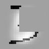

# Using Python Layers in your Caffe models with DIGITS

Caffe gives users the ability to [define custom layer types in Python](https://github.com/BVLC/caffe/pull/1703), instead of the usual C++/CUDA.
This can be a very useful feature, but it is poorly documented and tricky to implement correctly.
This walkthrough will show you how to get started with Python layers in DIGITS.

> NOTE: This feature is included automatically if you are building Caffe with CMake or installing the Deb package. If you are building with Make, you will need to uncomment "WITH_PYTHON_LAYER := 1" in your `Makefile.config` to enable it.

## Adding Occlusions to MNIST

For this example, we are going to train LeNet on the MNIST dataset, but we are going to add a Python layer which cuts out one fourth of the image before feeding it through the network.
This simulates occluded data and should result in a model which is robust to occlusions.

For example,  might become .

### Create a Dataset

First, follow [these instructions](../../docs/GettingStarted.md#creating-a-dataset) to create the MNIST dataset in DIGITS (if you haven't already).

### Create a Python File

Next, you'll want to create a Python file which contains the definition for your Python layer.
Open up a text editor and create a new file with these contents.
```python
import caffe
import random

class BlankSquareLayer(caffe.Layer):

    def setup(self, bottom, top):
        assert len(bottom) == 1,            'requires a single layer.bottom'
        assert bottom[0].data.ndim >= 3,    'requires image data'
        assert len(top) == 1,               'requires a single layer.top'

    def reshape(self, bottom, top):
        # Copy shape from bottom
        top[0].reshape(*bottom[0].data.shape)

    def forward(self, bottom, top):
        # Copy all of the data
        top[0].data[...] = bottom[0].data[...]
        # Then zero-out one fourth of the image
        height = top[0].data.shape[-2]
        width = top[0].data.shape[-1]
        h_offset = random.randrange(height/2)
        w_offset = random.randrange(width/2)
        top[0].data[...,
                h_offset:(h_offset + height/2),
                w_offset:(w_offset + width/2),
                ] = 0

    def backward(self, top, propagate_down, bottom):
        pass
```
Save the file. We'll upload it along with your model in the next section.

### Create a Model

> NOTE: If you've never created a model in DIGITS before, you might want to follow the walkthrough in the [Getting Started guide](../../docs/GettingStarted.md#training-a-model) before proceeding.

1. Click on `New Model > Images > Classification` from the homepage.
2. Select your MNIST dataset from the list of datasets.
3. Click on `Use client side file` and select the Python file that you created earlier.
4. Click on `LeNet` under `Standard Networks > Caffe`.
5. Click on the `Customize` link which appears to the right.


That will take us to a pane where we can customize LeNet to add our custom Python layer.
We are going to insert our layer in between the `scale` layer and the `conv1` layer.
Find those layers (a few lines from the top) and insert this snippet of prototxt in-between:
```
layer {
  name: "blank_square"
  type: "Python"
  bottom: "scaled"
  top: "scaled"
  python_param {
    module: "digits_python_layers"
    layer: "BlankSquareLayer"
  }
}
```
When you click on `Visualize`, you should see this:


Then simply give your model a name and click `Create`.
You should see your model training session start.
If you're paying attention, you'll notice that this model reaches a lower accuracy than the default LeNet network. Why is that?

> NOTE: The current version of Caffe doesn't allow multi-GPU for networks with Python layers.
If you want to use a Python layer, you need to use a single GPU for training.
See https://github.com/BVLC/caffe/issues/2936.

### Testing the Model

Now for the fun part.
Find an image in the MNIST test set and upload it to `Test a single image` (at the bottom of the page).
Don't forget to click on `Show  visualizations and statistics`!
The original image is displayed on the top left, next to the predicted class.
In the `Visualization` column, you'll see the result of subtracting the mean image as the `data` activation.
Just below it, you'll see the result of down-scaling the image from `[0 - 255]` to `[-1 - 1]`.
You'll also see that a random fourth of the image has been removed - that's thanks to our Python layer!


> NOTE: The second activation is displayed as a colorful heatmap, even though the underlying data is still single-channel and could be displayed as a grayscale image. The "data" activation is treated as a special case and all other activations are converted to heatmaps.

Congratulations, you have completed this tutorial!

### Extra credit

For extra credit, try to change your Python layer to crop out two smaller squares instead of one big one:


Or try adding the layer to AlexNet instead of LeNet:


### Discussion

If you actually wanted to build an occlusion-resistant model, you would only want to add occlusions to the training data - not to the validation or test data.
To do that, use this prototxt snippet instead to exclude the layer from the validation/test phases:
```
layer {
  name: "blank_square"
  type: "Python"
  bottom: "scale"
  top: "scale"
  python_param {
    module: "digits_python_layers"
    layer: "BlankSquareLayer"
  }
  include {
    phase: TRAIN
  }
}
```
