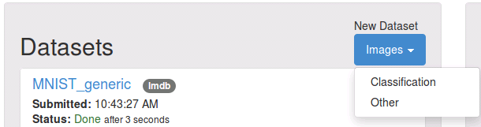
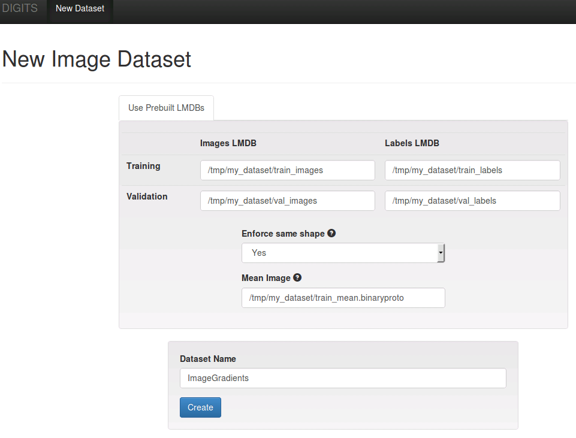
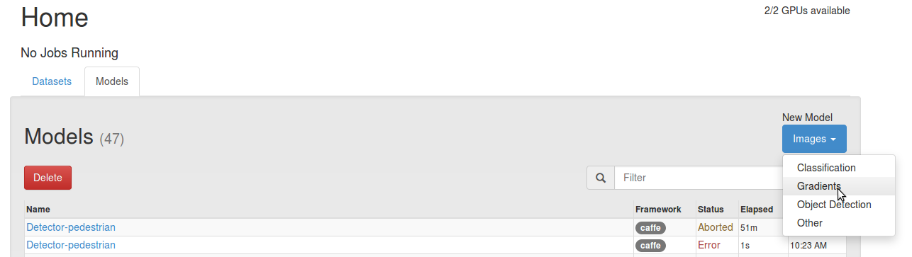
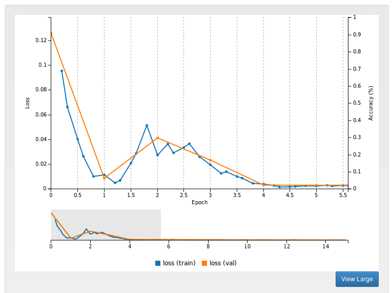
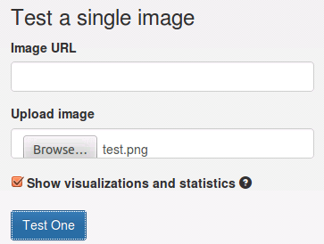
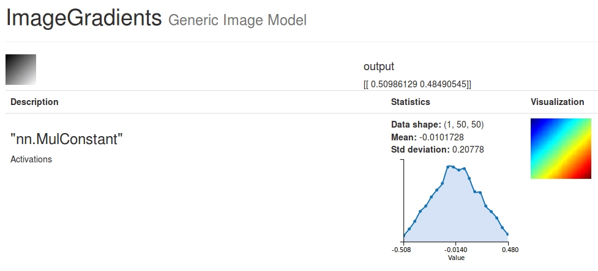

# Training an image regression model using DIGITS

Table of Contents
=================
* [Introduction](#introduction)
* [Dataset creation](#dataset-creation)
    * [Using Caffe](#using-caffe)
    * [Using Torch7](#using-torch7)
* [Model creation](#model-creation)
* [Verification](#verification)

## Introduction

Image classification models aim to learn to predict the class of an image, where each class is a discrete element from a finite set.
Image regression models may learn to predict any number of image characteristics. These characteristics are typically represented as a matrix or a vector of real numbers.
DIGITS may be used to train image regression models. This page will walk you through a simple example where a model is trained to predict the `x` and `y` gradients of a linear image
(a linear image is an image that has constant gradients in the `x` and `y` directions - `x` and `y` gradients may be different though).

## Dataset Creation

Non-classification datasets may be created in DIGITS through the "other" type of datasets. For these datasets, DIGITS expects the user to provide a set of LMDB databases.
Note that since labels may be vectors (or matrices), it is not possible to use a single LMDB database to hold the image and its label. Therefore DIGITS expects one LMDB database for the images and a separate LMDB database for the labels.

The first step in creating the dataset is to create the LMDB databases. In this example you will use the Python test script located in `/digits/dataset/images/generic/test_lmdb_creator.py`.
This script creates a number of grayscale linear images and adds them to a train database and a validation database. For each image, the `x` and `y` (normalized) gradients are chosen randomly from a uniform distribution `[-0.5,0.5)`.

To create a train database of 100 50x50 images:
```sh
$ ./digits/dataset/images/generic/test_lmdb_creator.py -x 50 -y 50 -c 100 /tmp/my_dataset
Creating images at "/tmp/my_dataset" ...
Done after 11.3920481205 seconds
```

The script also creates a validation database of 20 samples. Overall, the script creates train image and label databases, validation image and label
databases, train and validation mean images, and a test image.

See for example the `test.png` image which is created using gradients of 0.5 in both directions:


Now that we have created the required files, we may create the dataset using DIGITS. On the main page, click `New Dataset\Images\Other`:



In the generic dataset creation form you need to provide the paths to:
- the train image database
- the train label database
- the validation image database
- the validation label database
- the train mean image `train_mean.binaryproto` file



## Model creation

Now that you have a regression dataset to train on, you may create a regression model by clicking on `New Model\Images\Other` on the main page:



On the model creation form, select the dataset you just created. We will be creating a very simple fully linear model that consists of
just one fully connected layer. You may use either Caffe or Torch7 to define the model.

### Using Caffe

Under the `Custom Network` tab, select `Caffe`. There you can paste the following network definition:
```protobuf
layer {
  name: "scale"
  type: "Power"
  bottom: "data"
  top: "scale"
  power_param {
    scale: 0.004
  }
}
layer {
  name: "hidden"
  type: "InnerProduct"
  bottom: "scale"
  top: "output"
  inner_product_param {
    num_output: 2
  }
}
layer {
  name: "train_loss"
  type: "EuclideanLoss"
  bottom: "output"
  bottom: "label"
  top: "loss"
}
```

### Using Torch7
Under the `Custom Network` tab, select `Torch`. There you can paste the following network definition:
```lua
return function(p)
    local nDim=1
    if p.inputShape then p.inputShape:apply(function(x) nDim=nDim*x end) end
    local net = nn.Sequential()
    net:add(nn.MulConstant(0.004))
    net:add(nn.View(-1):setNumInputDims(3))
    net:add(nn.Linear(nDim,2))
    return {
        model = net,
        loss = nn.MSECriterion(),
    }
end
```

## Verification

After training for 15 epochs the loss function should look similar to this:

)

Now we can assess the quality of the model. To this avail, we can use the test image that was generated by `test_lmdb_creator.py`:



A new window will appear showing the test image and the output of the network, which is `[ 0.50986129 0.48490545]` and close enough
to the real gradients used to create the test image (`[0.5, 0.5]`).



