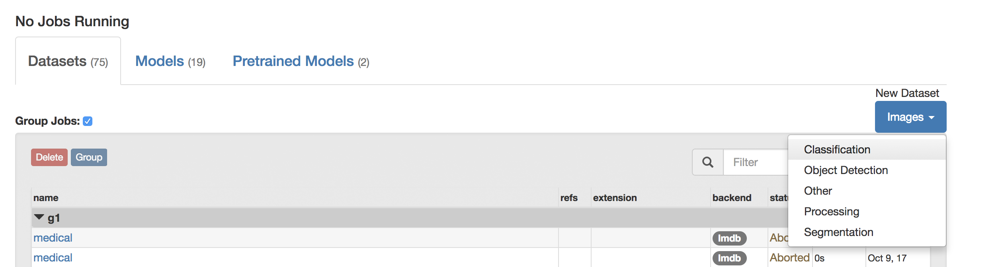
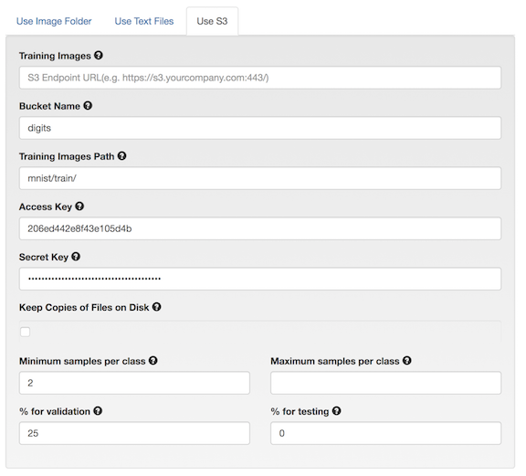
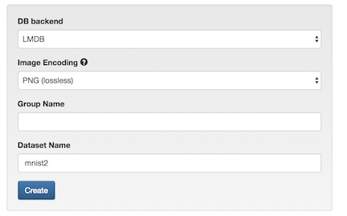

# Creating a dataset using data from S3 endpoint

Table of Contents
=================
* [Introduction](#introduction)
* [Loading Data into S3](#loading-data-into-s3)
* [Creating a Dataset](#creating-a-dataset)

## Introduction

DIGITS may also be trained on data stored at an S3 endpoint. This can be useful for cases in which data has been stored on a different node and the user does not want to have to manually migrate the data over to the node running DIGITS.

## Loading Data into S3

As an example, we will use the dataset provided by running
```sh
python -m digits.download_data mnist ~/mnist
```

We have provided a Python script "upload_s3_data.py" that can be used to upload these files into a configured S3 endpoint. This script and its accompanying configuration file "upload_config.cfg" is located at digits/digits/tools.

```sh
[S3 Config]
endpoint = http://your-s3-endpoint.com:80
accesskey = 0123456789abcde
secretkey = PrIclctP80KrMi6+UPO9ZYNrkg6ByFeFRR6484qL
bucket = digits
prefix = mnist
```

Below is a brief description of each field:

**endpoint** - This specifies the URL of the endpoint where the S3 data will be stored.

**accesskey** - The access key which will be used to authenticate your access to the endpoint.

**secretkey** - The secret key which will be used to authenticate your access to the endpoint.

**bucket** - The name of the bucket where this data should be stored. If it does not exist, it will be created by the script.

**prefix** - The prefix which will be prepended to all of the key names. This will be used later during the creation of the dataset.

Once that file has been configured appropriately, it may be run using:

```sh
python upload_s3_data.py ~/mnist
```

Be patient as this upload process will take quite a bit of time to complete, depending heavily on network speed and the computing resources of the S3 endpoint.

When it is complete, all of the keys from the dataset will be uploaded into S3 with the appropriate prefix structure to be used during dataset creation later. For example, in the above configuration, the files would be located in the bucket "digits" and prefixed with "mnist/train/<0-9>"

## Creating a Dataset

Now that we have loaded the data into S3, the next step is to create a dataset within DIGITS. On the main screen, click "Images" and then click "Classification".




On the next screen, click on the "Use S3" tab to specify you want the data to be accessed from an S3 endpoint. You will then see the fields in the below image.

The "Training Images" URL and "Bucket Name" may be filled out from the upload configuration fields "endpoint" and "bucket", respectively. The "Training Images Path" consists of the prefix specified during the upload appended by "train/". For our example, it would be "mnist/train/". The access key and secret key are the credentials which will be used to access the data from the S3 endpoint.





Similar to any other dataset, the properties including database backend, image encoding, group name, and dataset name may be specified towards the bottom of the screen. When the dataset has been configured the way you want, click Create.





If the job processes correctly, you will see the below in the following screen.


If you see the above, you have successfully created a dataset from data stored in an S3 endpoint. You may proceed to use this dataset to train model as you would any other.
