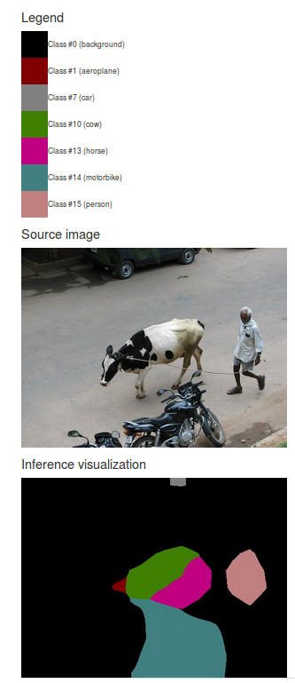

# Using DIGITS to train a Semantic Segmentation neural network

> NOTE: refer to this [Parallel-For-All blog post](https://devblogs.nvidia.com/parallelforall/image-segmentation-using-digits-5/) for a detailed review of Fully Convolutional Neworks for semantic segmentation.

Table of Contents
=================
* [Introduction](#introduction)
* [Dataset creation](#dataset-creation)
    * [Downloading and preparing the PASCAL VOC data](#downloading-and-preparing-the-pascal-voc-data)
    * [Loading the data into DIGITS](#loading-the-data-into-digits)
* [Model creation](#model-creation)
    * [FCN-Alexnet](#fcn-alexnet)
    * [Training FCN-Alexnet in DIGITS](#training-fcn-alexnet-in-digits)
* [Inference](#inference)
    * [Going further](#going-further)

## Introduction

In this tutorial we will see how DIGITS may be used to train a Semantic Segmentation network using the Caffe back-end.
Image Semantic Segmentation can be understood as a generalization of Image Classification where class predictions are made at a much finer grain, down to pixel level.
During inference, a grid mask of the input image is generated where the value of each element in the grid denotes the class of the object that the corresponding pixel in the input image represents.

For example in the image below a picture representing a horse rider is segmented.
In the resulting image mask, the person and the horse are correctly depicted using the color codes from the legend.


## Dataset creation

In this example, we will be using data from the [PASCAL VOC 2012](http://host.robots.ox.ac.uk/pascal/VOC/voc2012/index.html) dataset.

### Downloading and preparing the PASCAL VOC data

This dataset may be downloaded from the PASCAL web site: [2GB tar file](http://host.robots.ox.ac.uk/pascal/VOC/voc2012/VOCtrainval_11-May-2012.tar).

The dataset includes data for several computer vision tasks.
The task that is relevant to this tutorial is the Segmentation Class task.

Use the `prepare_pascal_voc.sh` script to create a train/val split of the labelled images:
```sh
$ ./prepare_pascal_voc_data.sh /data/VOCtrainval_11-May-2012.tar ./voc-data
Expanding /data/VOCtrainval_11-May-2012.tar
Copying data into ./voc-data
Processing train data
Processing val data
Done!
```

Let us take a look at one image/label pair:


On this example we can see an image of an airport airfield with a plane and several people.
The label image is showing the ground-truth delimitations for this image.
In PASCAL VOC, label images have the same size as the image to segment.
Shapes are color coded to represent the class of each object.
Black pixels represent background.
White pixels represent areas that should be ignored during training such as the borders of objects.
The label image is a single-channel 8-bit paletted image.
In an 8-bit paletted image every pixel value is an index into an array of 256 RGB values.
The color palette in PASCAL VOC is chosen such that adjacent values map to very different colors in order to make classes more easily distinguishable during visual inspection.
In PASCAL VOC, index 0 maps to black pixels (background) and index 255 maps to white pixels (don't care).
Other indices, starting from 1 up to 20, are for object classes.

Classes are mapped to numerical IDs as follows:
```
#0:   background
#1:   aeroplane
#2:   bicycle
#3:   bird
#4:   boat
#5:   bottle
#6:   bus
#7:   car
#8:   cat
#9:   chair
#10:  cow
#11:  diningtable
#12:  dog
#13:  horse
#14:  motorbike
#15:  person
#16:  pottedplant
#17:  sheep
#18:  sofa
#19:  train
#20:  tvmonitor
#255: undefined/don't care
```

### Loading the data into DIGITS

On the DIGITS home page, click `New Dataset > Images > Segmentation`:


In the dataset creation form, click `Separate validation images` then specify the paths to the image and label folders for each of the training and validation sets.

In `Class Labels` specify the path to `$DIGITS_ROOT/examples/semantic-segmentation/pascal-voc-classes.txt`.
This will allow DIGITS to print class names during inference.

In `Label Encoding` select `PNG (lossless)`.
This will help create a more compact label database.
This will also make it possible to view label images when exploring the label database.

In `Enforce Same Shape` select `No`.
This will make it possible to create a dataset in which the shapes of images and labels are not fixed.

> NOTE: the model we are going to train can work on images that do not have fixed dimensions.
> However this network expects RGB images.
> If you are following this walk-through to train a model on your own images, make sure these are RGB images.
> Alternatively, set the `Channel Conversion` field to force conversion to RGB.

Other fields can be left to their default value.

Finally, give your dataset a name and click `Create`:


After you have created the dataset you may browse the contents of the databases by clicking the `Explore DB` button on the dataset job page:


The feature database may look like:


The label database may look like below. Note how label images match feature images:


## Model creation

### FCN-Alexnet

In this example we will use [FCN-Alexnet](https://github.com/shelhamer/fcn.berkeleyvision.org/tree/master/voc-fcn-alexnet) from [fcn.berkeleyvision.org](http://fcn.berkeleyvision.org).
For more information on this model, refer to this paper:

```
Fully Convolutional Models for Semantic Segmentation
Jonathan Long*, Evan Shelhamer*, Trevor Darrell
CVPR 2015
arXiv:1411.4038
```

> NOTE: in order to train this network you will need NV-Caffe 0.15 or later, or a corresponding version of the main BVLC fork of Caffe.

### Training FCN-Alexnet in DIGITS

On the DIGITS home page, click `New Model > Images > Segmentation`:


To train FCN-Alexnet in DIGITS some minor customizations need to be made to the original FCN-Alexnet `prototxt` from fcn.berkeleyvision.org:
- `train`, `val` and `deploy` networks were merged into an all-in-one network description
- the custom `SBDDSegDataLayer` and `VOCSegDataLayer` layers have been replaced with regular `Data` layers to retrieve data from LMDB
- a `Power` layer was added to shift inputs by `-116.0` (in lieu of per-channel mean subtraction)
- since it is impractical to carry out 'net surgery' in DIGITS, a bilinear weight filler has been added to the `upscore` layer
- an accuracy layer was added to assess the performance of the model on the validation set
- in order to deal with the variable input image size, training and validation are carried out with a batch size of 1

In order to train FCN-Alexnet a suitable pre-trained model must be used.
It is common practice to use an ILSVRC2012-trained model.
Note however that a standard Alexnet model cannot be used as is, as it needs to be converted into an FCN beforehands (see next section).

#### Model "convolutionalization"

> NOTE: skip this section if you are not interested in the details of model convolutionalization and are already in possession of a pre-trained FCN-Alexnet

Standard CNNs like Alexnet perform non-spatial prediction, e.g. in the case of image classification the output of the network is a single distribution of class probabilities.
For image segmentation, a CNN may be converted into an FCN in order to carry out dense prediction.
The convolutional part of the CNN may be fully reused.
However, as explained in section 3.1 of the reference paper, the fully-connected layers of the CNN "throw away spatial coordinates".
In practice, the (non-terminal) fully-connected layers of the base model need to be "convolutionalized". Below is a brief overview of how this process works.

Consider Alexnet's `fc6` layer for example.
This fully-connected layer receives its input from `pool5` which has an output shape of `256x6x6`.
`fc6` produces an output vector of `4096` items.
Therefore `fc6` has `256x6x6x4096` weights and `256x6x6` bias terms, for a total number of `37757952` learnable parameters:


Now suppose you wish to perform exactly the same calculations as `fc6` but your input size is unknown and variable.
You could elect to follow a sliding-window approach where the input image is scanned from left to right, top to bottom, and have each window go through `fc6`.
This is exactly what a carefully-chosen convolution layer will do, assuming the input is larger than `256x6x6`.
Suppose your convolutional layer has `Mi=256` input feature maps, `Mo=4096` output feature maps, square kernels of size `K=6` and stride `S=1`.
If this layer receives an input blob of shape `MixHxW` then it can perform exactly the same calculations as `fc6` on `((H-K+1)/S)x((W-K+1)/S)` different windows.
The output blob will have a shape equal to `Mox((H-K+1)/S)x((W-K+1)/S)`.
Let us see how this works in practice on an example `375x500` RGB image input.
On this image the output of `pool6` is a `256x17x21` blob.
Therefore the convolutional layer's output blob will have a shape of `4096x12x16`.
In the below image, `fc6` is now a convolutional layer with the above parameters:


Interestingly you can see that the new `fc6` has exactly the same number of parameters as the old `fc6`.
It is actually possible to re-use those parameters from a trained Alexnet model into a "convolutionalized" FCN-Alexnet.
Since the actual shape of the parameters is different (even though the numbers of parameters are the same) Caffe will not do this automatically for you.
However it is possible to proceed to "net surgery" and "transplant" the weights of `fc6` from Alexnet to FCN-Alexnet.

#### Convolutionalizing Alexnet

You may use the `net_surgery.py` script to convolutionalize an ILSVRC2012-trained Alexnet model:

```
$ ./net_surgery.py
Downloading files (this might take a few minutes)...
Downloading https://raw.githubusercontent.com/BVLC/caffe/rc3/models/bvlc_alexnet/deploy.prototxt...
Downloading http://dl.caffe.berkeleyvision.org/bvlc_alexnet.caffemodel...
Loading Alexnet model...
...
Saving FCN-Alexnet model to fcn_alexnet.caffemodel
```

#### Further technical details

If you inspect the `prototxt` carefully you might notice that the learning rate multiplier for layer `upscore` is set to 0.
The reason behind this is this layer is merely there to perform bilinear interpolation of the `score_fr` layer so as to produce an upscaled version of its input.
Here we are using a bilinear weight filler to initialize the weights of this deconvolution layer such that the layer does bilinear interpolation of its input, with no further need for parameter learning, hence the null learning rate multiplier.

You might also be curious to understand the need for the `score` layer which is a `Crop` type of layer.
This layer is added to crop its input so as to compensate the shifts induced by the successive convolution and pooling layers down the network.
The offset value of `18` will work for any dataset however that offset value needs to be recomputed if the topology of the network changes.

#### Model creation form

On the model creation page:
- set `Subtract mean` to `none`
- select the dataset that was created in the previous section
- set the base learning rate to 0.0001
- select the `Custom Network` tab
  - make sure the `Caffe` sub-tab is selected
  - copy/paste this [prototxt](fcn_alexnet.prototxt)
- in `Pretrained model(s)` specify the path to the pre-trained FCN-Alexnet
- note that since we are using a batch size of 1 it is not possible to train this network on multiple GPUs

You may click `Visualize` to review the network topology:


#### Training

After training the model for 10 epochs the training curves may look like below.
Note that the accuracy is also computed over background pixels.


## Inference

The easiest way to visualize the network output is to select the Segmentation visualization extension:


The output of the network is a `SoftMax` layer.
Its `top` is a 3D blob with shape NxHxW, where N is the number of classes (including background) and W and H are the width and height of the input image, respectively.
For each pixel in the image, the segmentation visualization extension picks the class that has the highest probability.
If the images in the label dataset have a palette (as is the case for PASCAL VOC) then this visualization method will show the network output using the palette from the label dataset.

To perform inference on a test image:
- in the `Colormap` menu of the `Visualization Options`, choose `From Dataset`
- in the `Inference` options, tick the `Do not resize input image(s)` box
- in `Test a Single Image`, choose an image from the validation set
- Finally, click `Test One`


You may see something like:



Here is the corresponding label:


### Going further

In this example the network prediction is reasonably close to the ground truth however there is still a lot of room for improvement:
- try a more powerful model like FCN-8s, which was designed to make predictions at a much finer grain
- try training the model on a larger dataset, like the [Berkeley Segmentation Dataset](https://www2.eecs.berkeley.edu/Research/Projects/CS/vision/bsds/)
- try training the model on an augmented training set.
