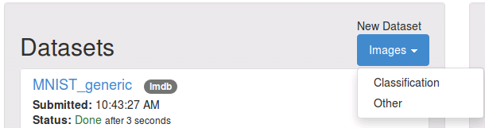
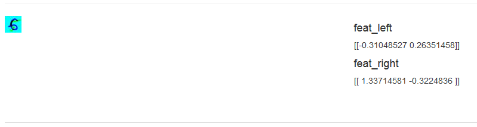

# Training a Siamese network using DIGITS

Table of Contents
=================
* [Introduction](#introduction)
* [Dataset creation](#dataset-creation)
* [Model creation](#model-creation)
* [Verification](#verification)

## Introduction

Siamese networks are commonly used in image comparison applications such as face or signature verification. In a typical Siamese network a large part of the network is duplicated at the base to allow multiple inputs to go through identical layers.
This example follows the Caffe [Siamese Tutorial](http://caffe.berkeleyvision.org/gathered/examples/siamese.html) and shows
how to use DIGITS to teach a neural network to map an image from the MNIST dataset to a 2D point, while trying to minimize the distance between points of the same class and maximize the distance between points of different classes.

## Dataset Creation

In our dataset, each input sample is a pair of images and the associated label is set to `1` when both images are from the same class (i.e. both images represent the same digit) and `0` when images are from different classes.

Since DIGITS expects input data to be images, we will create one RGB image for each pair of (grayscale) images in the MNIST
dataset:
- the Blue channel will contain the first image in the pair
- the Green channel will contain the second image in the pair
- the Red channel will be unused and set to 0.

If you followed the introductory walkthrough on [GettingStarted](../../docs/GettingStarted.md), you should have the MNIST dataset created in DIGITS already and DIGITS will have conveniently created a list of MNIST image paths and stored it in a file called `train.txt`.

Click on your MNIST image classification model to display dataset information: this will allow you to find the path to the job directory which includes the `train.txt` file:


In this example the path is `/fast-scratch/gheinrich/ws/digits/digits/jobs/20151111-210842-a4ec`.

Non-classification datasets may be created in DIGITS through the "other" type of datasets. For these datasets, DIGITS expects the user to provide a set of LMDB databases.
Note that since labels may be vectors (or matrices), it is not possible to use a single LMDB database to hold the image and its label. Therefore DIGITS expects one LMDB database for the images and a separate LMDB database for the labels.

The first step in creating the dataset is to create the LMDB databases. In this example you will use the Python test script located in `/examples/siamese/create_db.py`.

To create a train database of 100000 pairs of images into a folder called `siamesedb`:
```sh
$ cd $DIGITS_HOME/examples/siamese
$ create_db.py siamesedb ../../digits/jobs/20151111-210842-a4ec/train.txt  -c 100000
```
The script also creates a validation database of 1000 samples. Overall, the script creates:
- train image and label databases,
- validation image and label databases,
- train and validation mean images,
- two sets of 10 test images: one set includes images that are taken from the same class, the other set includes images that are taken from different classes

Now that we have created the required files, we may create the dataset using DIGITS. On the main page, click `New Dataset > Images > Other`:



In the generic dataset creation form you need to provide the paths to:
- the train image database
- the train label database
- the validation image database
- the validation label database
- the train mean image `train_mean.binaryproto` file


## Model creation

Now that you have a regression dataset to train on, you may create a Siamese model by clicking on `New Model > Images > Other` on the main page:


On the model creation form, select the dataset you just created. Under the `Custom Network` tab, select `Caffe`. There you can paste this [network definition](mnist_siamese_train_test.prototxt) then give your model a name and click `Create`.

Click on the `Visualize` button to see a graphical depiction of the network architecture:


This model uses two instances of LeNet to map each of the MNIST images from a pair of images into a representation of two neurons. On this model, a contrastive loss layer is used with a margin of `1` therefore the training objective is to map images of different classes to points that are at least `1` unit appart (L2 distance wise) and images of the same class
to points that are as close as possible to each other.

## Verification

After training for 30 epochs the loss function should look similar to this:


Now we can assess the quality of the model. To this avail, we can use the test images that were generated by `create_db.py`.
At the bottom of the model page, in the `Upload Image` field, select for example image `val_test_different_class_0.png`. Don't forget to click on `Show visualizations and statistics`.

Note how the image looks like two overlapping digits (a `5` and a `6` in this case). Here the left image is mapped to point `[-0.31048527 0.26351458]` and the right image is mapped to point `[ 1.33714581 -0.3224836 ]`. The L2 distance between these points is `1.74` i.e. greater than `1`.



Note also how the network is extracting each individual image from the channels of the original images:


Now run the same test using image `val_test_same_class_0.png`. In this case this maps two different representations of
a `2` to `[-0.23325665 -1.02958131]` and `[-0.13545063 -1.07779765]`, with an L2 distance of `0.109` i.e. much smaller than `1`.


In this case the training objective is met: images from the same class are very close to each other in 2D space, while the distance between images of different classes is greater than `1`.

You can also provide DIGITS with any grayscale image from the MNIST dataset and DIGITS will convert it to an RGB image. In that case
the left and right components of the Siamese network will be activated in the same way and will produce the same feature vectors. You
can also use DIGITS `/models/images/generic/infer_many.json` route to compute the feature vectors of all the images in the MNIST
dataset in one command line:

```
curl localhost:5000/models/images/generic/infer_many.json -XPOST -F job_id=20151203-082705-7ad6 -F image_list=@../../digits/jobs/20151111-210842-a4ec/train.txt > predictions.txt
```

The above command dumps all predictions into a large file that can be parsed to display clusters of image classes as in the below figure:


In the above figure we can see how the model has learnt to separate classes into ten clusters.
