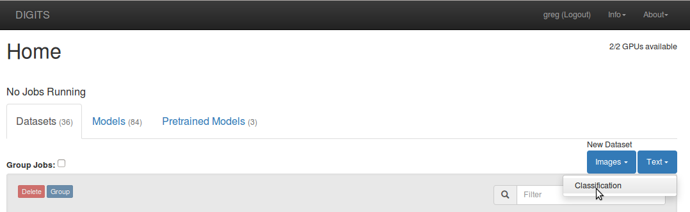
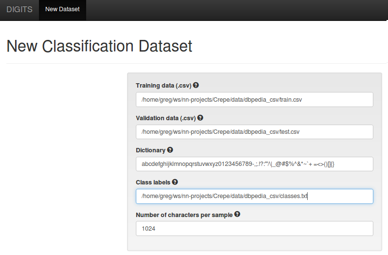
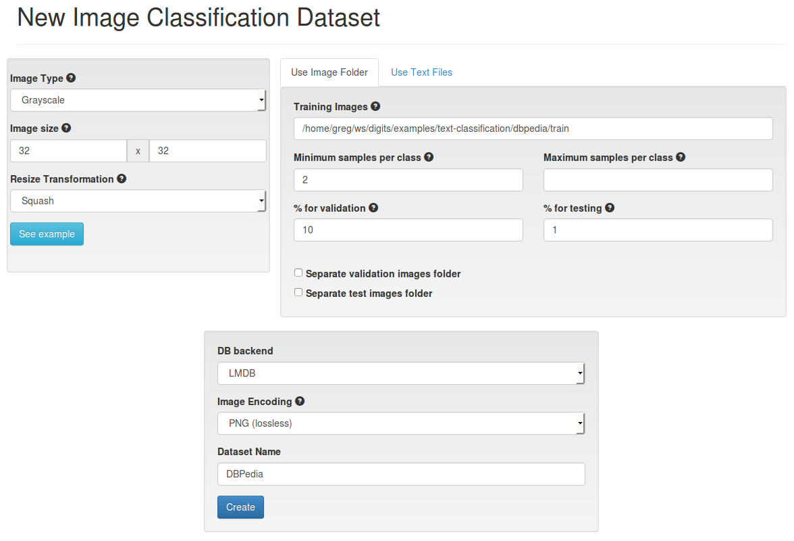
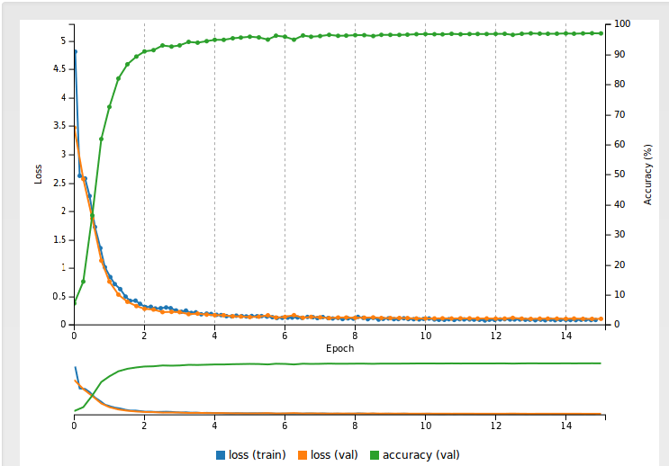
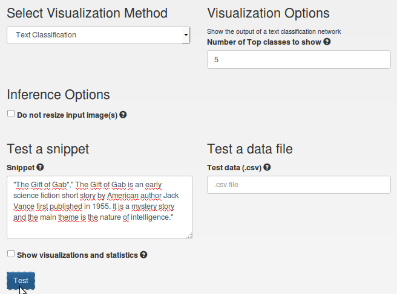
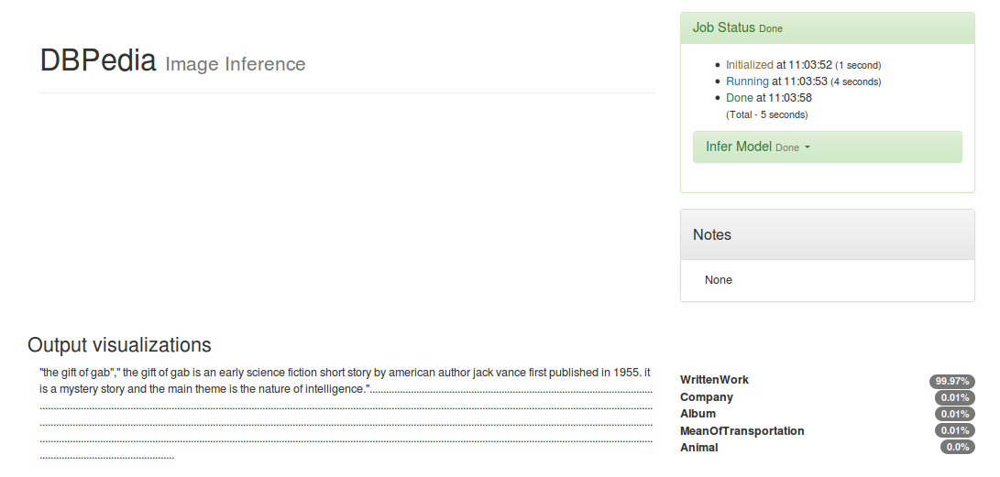
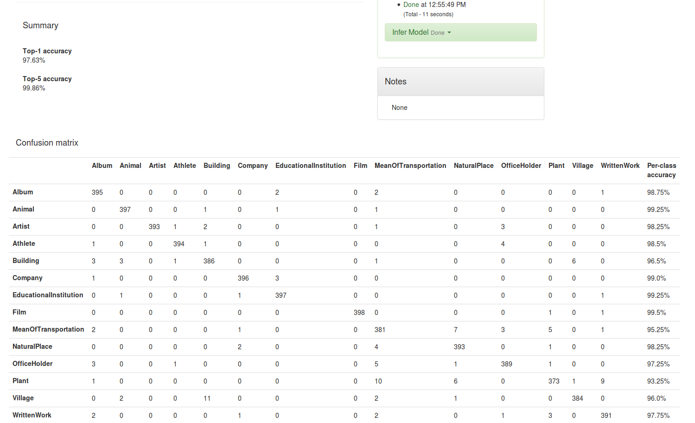
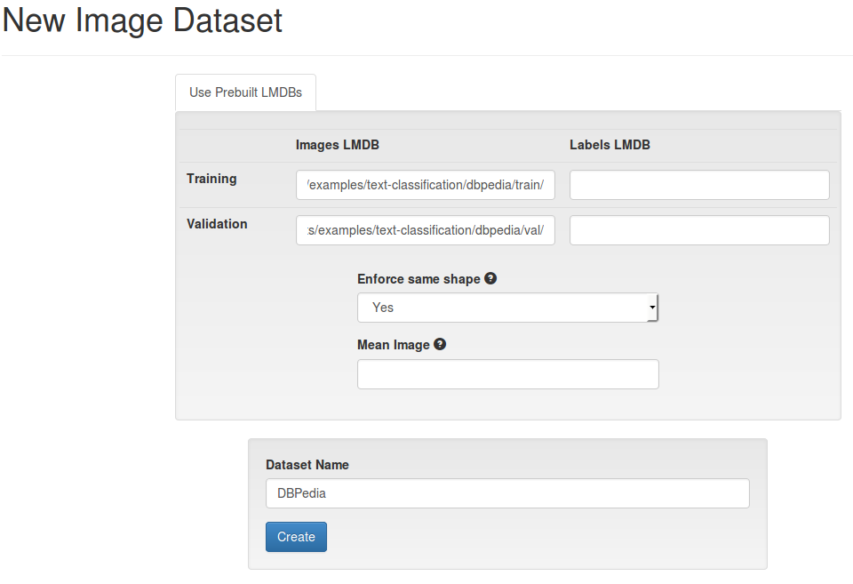
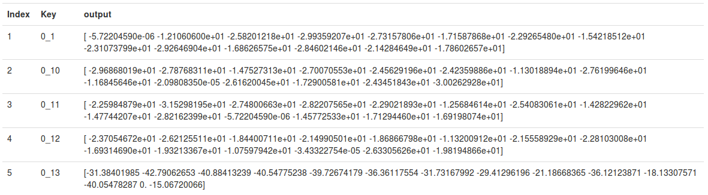

# Text classification using DIGITS and Torch7

Table of Contents
=================
* [Introduction](#introduction)
* [Dataset creation](#dataset-creation)
    * [Using the text classification plug-in](#using-the-text-classification-plug-in)
    * [Using images](#using-images)
* [Model creation](#model-creation)
* [Verification](#verification)
* [Alternative Method](#alternative-method)

## Introduction

This example follows the implementation in [Crepe](https://github.com/zhangxiangxiao/Crepe) of the following paper:

Xiang Zhang, Junbo Zhao, Yann LeCun. [Character-level Convolutional Networks for Text Classification](http://arxiv.org/abs/1509.01626). Advances in Neural Information Processing Systems 28 (NIPS 2015)

This shows how to create a feed-forward convolutional neural network that is able to classify text with high accuracy.
The network operates at the character level and does not require any feature engineering, beside converting characters to arbitrary numbers.

## Dataset Creation

We will use the [DBPedia](http://wiki.dbpedia.org) ontology dataset.
This dataset is available in `.csv` format on @zhangxiangxiao's [Google Drive storage](http://goo.gl/JyCnZq).
Download the file `dbpedia_csv.tar.gz` and extract its contents into a folder which we will later refer to as `$DBPEDIA`.

The following sample is an example from the "company" class:

> "E. D. Abbott Ltd"," Abbott of Farnham E D Abbott Limited was a British coachbuilding business based in Farnham Surrey trading under that name from 1929. A major part of their output was under sub-contract to motor vehicle manufacturers. Their business closed in 1972."

### Using the Text Classification plug-in

> This method is available from DIGITS 5.0 onwards.

If you have not done so already, install the top-level DIGITS package.
Point the `$DIGITS_ROOT` envvar to the top of your DIGITS installation then do:
```sh
$ pip install -e $DIGITS_ROOT
```

Install the text classifications plug-ins:
```sh
$ pip install $DIGITS_ROOT/plugins/data/textClassification
$ pip install $DIGITS_ROOT/plugins/view/textClassification
```

Restart DIGITS then on the home page, click `New Dataset > Text > Classification`:



On the dataset creation page:
- point to your training set `$DBPEDIA/dbpedia_csv/train.csv`
- point to your validation set `$DBPEDIA/dbpedia_csv/test.csv` (we will use the test set as a validation set in this example)
- point to your `$DBPEDIA/dbpedia_csv/classes.txt`



When you are ready, give your dataset a name and click `Create`.

### Using images

> Prior to DIGITS 5.0, classification models required prior conversion of the data into images.
This section explains how this was done.
Move on to the next section if you are using the text classification plug-in.

The first step to creating the dataset is to convert the `.csv` files to a format that DIGITS can use:
```sh
$ cd $DIGITS_ROOT/examples/text-classification
$ ./create_dataset.py $DBPEDIA/dbpedia_csv/train.csv dbpedia/train --labels $DBPEDIA/dbpedia_csv/classes.txt --create-images
```

This script parses `train.csv` in order to generate one sample per entry in the file.
Every entry is converted into a 1024-long vector of bytes.
Characters are converted using a very simple mapping: strings are first converted to lower case and each character is replaced with its index (note: indices start from number `2`) in the extended alphabet (abc...xyz0...9 + a number of signs). Other characters (including those that are used for padding) are replaced with number `1`.
Note we have not implemented the backward quantization order mentioned in paragraph 2.2 of the paper.
The script then proceeds to reshaping data into a `32x32` matrix and saves the matrix into an unencoded LMDB file.
The above command additionally enables saving each sample into an actual image file.
Image files are saved into sub-folders that are named after the sample's class.
This makes it possible to have DIGITS proceed as if we were creating an image classification network.
We will see later how that step may be skipped.

On the DIGITS homepage, click `New Dataset > Images > Classification` then:
- change the image type to `grayscale` and the image height and width to `32`,
- point to the location of your dataset,
- use 10% of samples for validation and 1% for testing,
- make sure the image encoding is set to PNG (lossless),
- give your dataset a name then click the "Create" button.



## Model Creation

If you haven't done so already, install the `dpnn` Lua package:

```sh
luarocks install dpnn
```

If you created your dataset using the Text Classification plug-in, click `New Model > Text > Classification` on the homepage.
If you created your dataset using images, click `New Model > Images > Classification`.

On the model creation page:
- select the dataset you just created,
- set the Mean Subtraction method to "None",
- select the "Custom Network" pane then click "Torch",
- in the Custom Network field paste this [network definition](text-classification-model.lua)
- give your model a name

Optionally, for better results:
- set the number of training epochs to `15`,
- set the validation interval to `0.25`,
- click "Show advanced learning rate options",
- set the learning rate policy to "Exponential Decay",
- set Gamma to `0.98`.

The model resembles a typical image classification convolutional neural network, with convolutional layers, max pooling, dropouts and a linear classifier.
The main difference is that the each character is one-hot encoded into a vector and 1D (temporal) convolutions are used instead of 2D (spatial) convolutions.

When you are ready, click the "Create" button.

After a few hours of training, your network loss and accuracy may look like:



**NOTE**: There is a minor bug in cuDNN v5.1.10 that you may run into with this example.
On Kepler GPUs (e.g. K80), you may have very bad performance (time estimates in the hundreds of days!).
If so, cuDNN is suggesting an inappropriate algorithm to use.
You can override this easily - simply replace this line:
```lua
    -- [(1018-3)/3+1=339] x 256
    net:add(backend.TemporalConvolution(256, 256, 7))
```
With these lines:
```lua
     -- [(1018-3)/3+1=339] x 256
    local conv2 = backend.TemporalConvolution(256, 256, 7)
    conv2:setMode(nil, 0, nil)
    net:add(conv2)
```
That will force cuDNN to use a different algorithm. If you're into applying git patches, [use this](https://gist.github.com/lukeyeager/48a852f90c1366c9a123ba183bc1eda2).

## Verification

At the bottom of the model page, select the model snapshot that achieved the best validation accuracy (this is not necessarily the last one).

If you created your dataset using the text classification plug-in you will be able to enter text or upload a `.csv` file directly in DIGITS.
Scroll down to the bottom of the model page, select the `Text Classification` visualization method and type text in the `Test a snippet` section:



When you are ready, click the "Test" button.
The output may be rendered as below:



If you want to test multiple examples at once, simply create a `.csv` file and use `Test a data file`.

If you created your dataset using images you can upload the `test.txt` file from your dataset job folder in the "Test a list of images" section.
This text file was created by DIGITS during dataset creation and is formatted in a way that allows DIGITS to extract the ground truth and compute accuracy and a confusion matrix.
There you can also see Top-1 and Top-5 average accuracy, and per-class accuracy:



## Alternative Method

> NOTE: from DIGITS 5.0 onwards it is recommended to use the text classification plug-in instead of manually creating LMDB files.
You may however review this section if you are interested in an example showing how to use manually created LMDBs and the REST API for inference.

If you think creating image files to represent text is overkill, you might be interested in this: you can create LMDB files manually and use them in DIGITS directly.
When you created the dataset with `create_dataset.py`, the script also created an LMDB database out of `train.csv`.
You can use the same script to create another database out of `test.csv` (from DBPedia ontology dataset), for validation purpose:

```sh
./create_dataset.py $DBPEDIA/dbpedia_csv/test.csv dbpedia/val
```

On the DIGITS homepage, click `New Dataset > Images > Other` then:
- in the "Images LMDB" column, select the paths to your train and validation databases, respectively (note that the labels are encoded in these databases so you don't need to specify an alternative database for labels)
- give your dataset a name then click 'Create'.



What difference does it make to use this alternative method?
The main difference is that you do not need to create image files to create the dataset in DIGITS as you can pass LMDB files directly.
This can save a significant amount of time.
This also implies that you get more freedom in the data formats that you wish to use, as long as you stick to 3D blobs of data.
You may for example choose to work with 16-bit or 32-bit data, or you may choose to work with blobs that have a non-standard or unsupported number of channels.
There is a downside though: since DIGITS is not told that you are creating a classification model, DIGITS does not process the network outputs in any way.
For classification models, DIGITS is able to extract the predicted class by identifying which class had the highest probability in the SoftMax layer.
For generic ("other") models, DIGITS only shows the raw network output.
Besides, quality metrics like accuracy of confusion matrices are not computed automatically for those models.

In order to create the model, on the DIGITS homepage, click `New Model > Images > Other` then proceed exactly as you did when creating the image classification model.

After training you can test samples using the "Test a Database" section.
You just need to point to the location of an LMDB database, for example the validation database.

The following snapshot shows the first 5 inference outputs from the validation dataset:



Each line shows the contents of the `logSoftMax` layer, for each sample.
The LMDB key format used by `create_dataset.py` is `(%d_%d) % (index,class)`: for the first item in the database, the key is `0_1`, which means that the item is from class `1`.
You can see that the output takes its maximum at index 1 (indices starting from 1), therefore it was correctly classified.
The predicted probability for class 0 is `math.exp(-5.72204590e-06)=0.99999427797047` (a high degree of confidence).

You may also choose to use the REST API to download predictions in JSON format.
This could be useful if you wish to implement any kind of post-processing of the data.
In the below command, replace the `job_id` and `db_path` with your job ID and LMDB path respectively:

```sh
curl localhost:5000/models/images/generic/infer_db.json -XPOST -F job_id=20160414-040451-9cc5 -F db_path="/path/to/dbpedia/test" > predictions.txt
```

Running this command will dump inference data in a format similar to:
```
{
  "outputs": {
    "0_1": {
      "output": [
        -5.7220458984375e-06,
        -12.106060028076,
        -25.820121765137,
        -29.935920715332,
        -27.315780639648,
        -17.158786773682,
        -22.92654800415,
        -15.421851158142,
        -23.10737991333,
        -29.26469039917,
        -16.862657546997,
        -28.460214614868,
        -21.428464889526,
        -17.860265731812
      ]
    },
    ...
```


