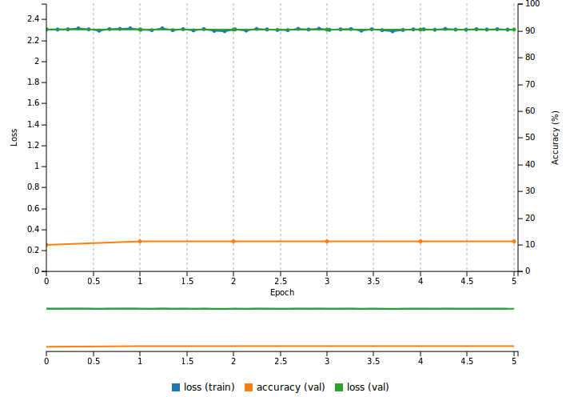

# Weight Initialization

Table of Contents
=================
* [Introduction](#introduction)
* [Selecting a weight initialization strategy](#selecting-a-weight-initialization-strategy)
* [Experiments with LeNet on MNIST](#experiments-with-lenet-on-mnist)

## Introduction

Weight initialization can critically affect the speed at which a neural network is able to learn.
Under certain circumstances, a poor initialization of weights can prevent a neural network from learning anything.

In this series of examples we will see how a flavor of the canonical LeNet neural network is able to learn from the MNIST dataset, under various weight initialization schemes.

## Selecting a weight initialization strategy

### Under Caffe

Caffe makes it straightforward to select one of the various supported weight initialization methods. In the `prototxt` definition of the network: each layer can specify how to initialize weights through a `weight_filler` field .
For example, in order to set the initial weights to a constant `0.2`:

```
weight_filler {
      type: "constant"
      value: 0.2
    }
```

The initialization of the bias terms can also be specified through a `bias_filler` field, although this tends to have a lesser impact on learning so we will focus on the initialization of weights in the following examples.

### Under Torch7

Most layers make it straightforward to initialize weights randomly from a uniform distribution over `[-std, std]` by calling their `reset(std)` method.
However the determination of the range to use has been the subject of a lot of research and we will see that this is often the key to efficient learning in a convolutional network.

The [torch-toolbox project](https://github.com/e-lab/torch-toolbox/tree/master/Weight-init) implements a handy way of quickly experimenting with different ways to compute the
`std` parameter to use in the call to the `reset()` method.
If you wish to use non-default weight initialization, you may write:

```lua
local method = 'xavier'
local model = require('weight-init')(model, method)
```

Assuming `model` points to your existing model then the new model will be initialized according to the "Xavier" method.

> NOTE: at the time of writing, the `torch-toolbox` project does not handle all layers (most notably `cudnn.SpatialConvolution`) so you might need to tailor the script to your specific needs.

## Experiments with LeNet on MNIST

### Constant Initialization

This is the default initialization scheme in Caffe: weights are initialized to a constant `0`. LeNet is unable to learn anything with this initialization, presumably because the constant initialization makes it difficult to break the symmetry of activations:



### Uniform distribution

This is how weights are initialized in Caffe when choosing the `uniform` filler. By default, weights are picked randomly from a uniform distribution over [0,1].
LeNet is unable to learn anything with this initialization:


The parameters of the uniform distribution may be changed through `min` and `max` keys. For example:
```
weight_filler {
  type: "uniform"
  min: -0.5
  max: 0.5
}
```

Under this initialization scheme the network is able to learn something:


### "Efficient Backprop" initialization

By default Torch7 uses the initialization scheme described in `LeCun, Yann A., et al. "Efficient backprop." Neural networks: Tricks of the trade. Springer Berlin Heidelberg, 2012. 9-48.`for linear and convolutional layers.
Initial weights are randomly picked from a `U[-1/sqrt(fan_in),1/sqrt(fan_in)]` distribution.
This is what the learning curve looks like under this scheme:


This performs reasonably well, considering the fact that this is a fully automatic way of setting the initial weights which does not require hand picking the range of the uniform
distribution.

### "Xavier" a.k.a. "Normalized" initialization

This initialization was first introduced in `Glorot, Xavier, and Yoshua Bengio. "Understanding the difficulty of training deep feedforward neural networks" International conference on artificial intelligence and statistics. 2010.`. Initial weights are randomly picked from a `U[-sqrt(3/n),sqrt(3/n)]`, where `n` is the fan-in (default), fan-out, or their average. According to the paper this initialization is particularly well suited for layers that are followed by a Sigmoid activation unit. Learning is very efficient under this scheme:


### "Kaiming" a.k.a. "MSRA" initialization

This initialization was first introduced in `He, Kaiming, et al. "Delving deep into rectifiers: Surpassing human-level performance on imagenet classification." arXiv preprint arXiv:1502.01852 (2015)`.
This initialization scheme is well suited for layers that are followed by a ReLU non-linear unit, particularly in the case of very deep networks.
Even in this "shallow" example (which does use a ReLU non-linearity) we can see that the network is able to learn even more quickly than under the Xavier initialization scheme:


