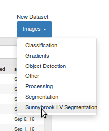

# Writing a DIGITS plug-in

Table of Contents
=================
* [Introduction](#introduction)
* [Data Plug-in](#data-plug-in)
* [Visualization Plug-in](#visualization-plug-in)

## Introduction

DIGITS supports ingesting data from a limited number of data sources ([list of supported image file formats](https://github.com/NVIDIA/DIGITS/blob/digits-5.0/digits/utils/image.py#L37)).
DIGITS data plug-ins enable a mechanism by which you can extend DIGITS to ingest data from custom sources.
Likewise, DIGITS offers a number of model output visualization types such as Image Classification, Object Detection or Image Segmentation.
DIGITS visualization plug-ins make it possible to visualize the output of non-standard models.
This guide will walk you through the process of adding your own plug-in.

## Data Plug-in

We will implement a data plug-in for image segmentation that reads images from DICOM files and their ground-truth from text files.
This plug-in has already been featured in the [medical imaging example](https://github.com/NVIDIA/DIGITS/tree/digits-5.0/examples/medical-imaging).
This plug-in is referred to as the "Sunnybrook" plug-in, from the name of the corresponding dataset.
The full code is available [there](https://github.com/NVIDIA/DIGITS/tree/digits-5.0/plugins/data/sunnybrook).

DIGITS may use a data plug-in in two situations:
- when creating a new dataset, in order to create a database,
- when performing inference, in order to feed data to a model.

> NOTE: a lot of the concepts we need to understand to create a data plug-in immediately apply to writing visualization plug-ins too.

Upon installation of the plug-in, DIGITS will start showing a corresponding menu on the main page.
For example:



Optionally if your data module has indicated that it can also ingest data during inference, an option will be displayed in the "visualization options" menu of the model page.

### Data plug-in file tree

Below is an example file tree for a data plug-in:

```
sunnybook/
├── digitsDataPluginSunnybrook/
│   ├── templates
│   │   ├── dataset_template.html
│   │   └── inference_template.html
│   ├── __init__.py
│   ├── data.py
│   └── forms.py
├── MANIFEST.in
└── setup.py
```

In the next few sections we will review important files that need to be created in order to write a plug-in.

### setup.py

This specifies how to install the plug-in.
The main section of interest here is the invocation of the `setup` command from `setuptools` package:

```python
setup(
    name="digits_sunnybrook_data_plugin",
    version="0.0.1",
    author="Greg Heinrich",
    description=("A data ingestion plugin for the Sunnybrook cardiac dataset"),
    long_description=read('README'),
    license="Apache",
    packages=find_packages(),
    entry_points={
        DIGITS_PLUGIN_GROUP: [
        'class=digitsDataPluginSunnybrook:DataIngestion',
        ]},
    include_package_data=True,
    install_requires=['pydicom'],
)
```

Make a good note of these arguments:
- `entry_points`: upon installation, the Python package will export entry points. Here we are assigning the `DataIngestion` class from the `digitsDataPluginSunnybrook` package to the `DIGITS_PLUGIN_GROUP` entry point group. This will make it possible for DIGITS to discover installed plug-ins on start-up.
- `install_requires`: this is where we specify the list of Python package dependencies for this plug-in (in this case the plug-in requires the `pydicom` package).

### MANIFEST.in

This specifies the resource files to include in the plug-in package.
Here were are recursively including all `.html` files within the `digitsDataPluginSunnybrook` folder.
If you are writing your own plug-in make sure these files are located inside the package folder.

```
recursive-include digitsDataPluginSunnybrook *.html
```

### digitsDataPluginSunnybrook/__init__.py

This files indicates that the folder `digitsDataPluginSunnybrook` is a Python package.
In most cases this can be left empty.
In our case we are creating a shortcut to the `DataIngestion` member of file `data.py` so we can refer to it as `digitsDataPluginSunnybrook:DataIngestion` in `setup.py`.

### digitsDataPluginSunnybrook/data.py

This file implements a `DataIngestion` class, which implements a DIGITS [data extension interface](https://github.com/NVIDIA/DIGITS/blob/digits-5.0/digits/extensions/data/interface.py).
Take a moment to review the interface API and docstrings.
The `DataIngestion` class is the only interface between DIGITS and the Sunnybrook plug-in.
Have a look at the interface for details on the required methods to implement in this class.
The most important ones are:
- `get_dataset_form`: this is a static method that returns a form (a child of `flask_wtf.Form`) which contains all the fields required to create a dataset. For example a form may include text fields to allow users to specify file names or various dataset options.
- `get_dataset_template`: this is a static method that returns a Jinja template for the form to display in the DIGITS web user interface; this method also returns a dictionary of context variables that should include all the variables that are referenced in the Jinja template. For example, the Sunnybrook plug-in gives `form` as context because the Jinja template references this variable to render the form into the web user interface.
- `get_inference_form`: this is similar to `get_dataset_form` but this is used when showing data ingestion options during inference. Note that this method may return `None` to indicate that your data plug-in cannot be operated during inference. In this case, it is expected that the regular image inference option in DIGITS will work for the model you are training.
- `get_inference_template`: this is similar to `get_dataset_template` but this is used during inference.
- `__init__`: this is the initialization routine used to create an instance of the class. During initialization this is provided with two parameters. The first parameter is named `is_inference_db` and indicates whether this instance is going to be used during inference. The second parameter is a dictionary that contains all the form fields that were specified by the user either during dataset creation or when specifying data options for inference.
- `itemize_entries`: this instance method parses form fields in order to generate a list of data sample identifiers. For example, if your data plug-in needs to encode all the files in a directory then the itemized entries could be a list of all the filenames.
- `encode_entry`: this instance method is the core of the data plug-in: it reads data associated with one of the identifiers returned in `itemize_entries` and converts the data into a 3-dimensional Numpy array. This function also returns a label, which may be either a scalar or another 3-dimensional Numpy array. Note how the process of reading an image in a DICOM file is relatively straightforward:
    ```python
    f = dicom.read_file(full_path)
    img = f.pixel_array.astype(np.int)
    ```

### digitsDataPluginSunnybrook/form.py

This is where we define the `DatasetForm` class to use to specify a dataset and optionally the `InferenceForm` class to specify inference data.
In the Sunnybrook example, instances of these classes are created and returned in `DataIngestion:get_dataset_form` and `DataIngestion:get_inference_form`, respectively.
These classes are children of `flask_wtf.Form`.
Refer to the [WTForms doc](https://wtforms.readthedocs.io/en/latest/) for more information.

### digitsDataPluginSunnybrook/templates/dataset_template.py

This is a Jinja template that defines what the user will see in the Web user interface.
Refer to the [Jinja doc](http://jinja.pocoo.org/docs/2.9/) for more information.
Note how the Sunnybrook template references the `form` variable which you will remember was given as context in `DataIngestion:get_dataset_template`.
For example:

```
{{ form.image_folder.label }}
```

### digitsDataPluginSunnybrook/templates/inference_template.py

This is the Jinja template to show inference data options.

### Installing the plug-in

In order to install the plug-in, run this command from the directory that includes your data plug-in's `setup.py`:

```sh
$ pip install .
```

You then need to restart DIGITS for the changes to take effect.

## Visualization Plug-in

Visualization plug-ins work in a very similar way to data plug-ins.
The main difference is that visualization plug-ins implement the [view interface](https://github.com/NVIDIA/DIGITS/blob/master/digits/extensions/view/interface.py).
Refer to the inline docstrings in this file for more information on usage.
